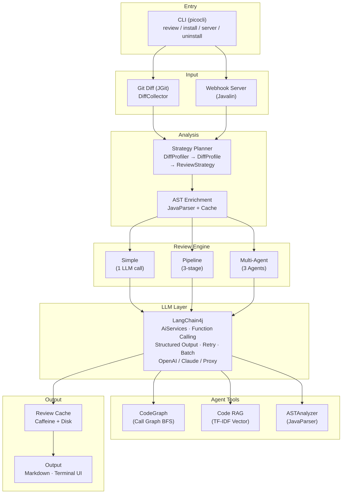
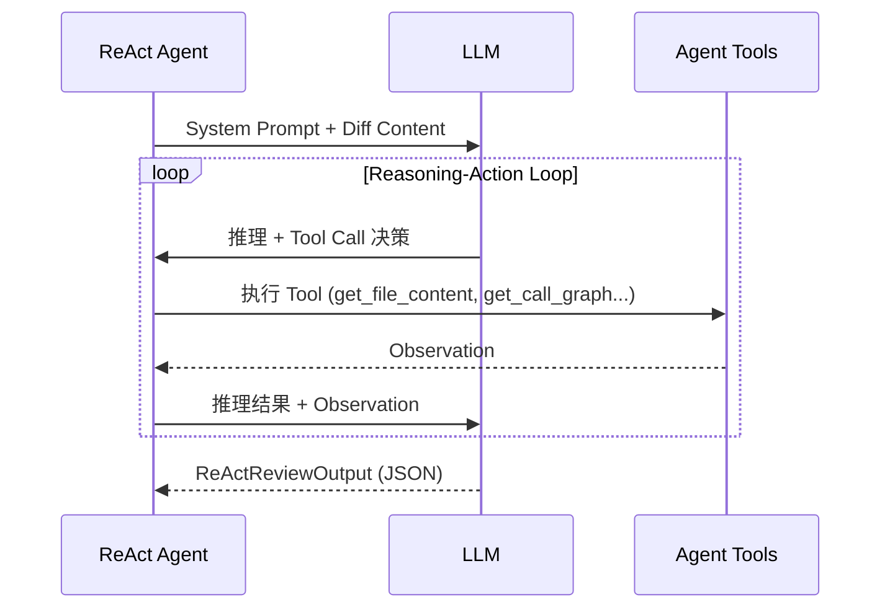

<div align="center">

# DiffGuard

**基于 LLM 的智能代码审查 Agent — 在提交时守护你的代码仓库**

[English](README_EN.md) | 中文

[](LICENSE)
[](https://openjdk.org/)
[](https://github.com/kunxing/diffguard/actions)
[](https://github.com/langchain4j/langchain4j)
[]()

</div>

---

## 项目简介

DiffGuard 是一个基于 LLM 的代码审查 Agent。它通过 Git Hook 在 `pre-commit` / `pre-push` 阶段自动拦截代码变更，执行多维度 AI 审查，在发现严重问题时阻止提交。同时支持 GitHub Webhook 模式，在 Pull Request 中自动发表审查评论。

代码审查是保障软件质量的关键环节，但人工审查受限于时间、专注度和经验覆盖面。DiffGuard 的目标不是替代人工审查，而是作为第一道自动防线——在提交阶段捕获安全漏洞、逻辑错误和性能问题，让审查者的精力集中在架构和业务逻辑上。

不同于简单的 "diff + prompt" 工具，DiffGuard 构建了完整的代码理解管线：基于 JavaParser 的 AST 解析、方法级调用图、TF-IDF 语义检索（Code RAG），以及具备 Tool Calling 能力的 ReAct Agent 架构。多个专业 Agent（安全 / 性能 / 架构）可并行工作，自适应调整审查策略。

## 核心特性

| 特性 | 描述 |
|------|------|
| **Git Hook 集成** | `pre-commit` / `pre-push` 阶段自动触发审查，CRITICAL 问题阻止提交 |
| **GitHub Webhook** | 监听 PR 事件，自动审查代码并发表 GFM 评论，含签名验证和限流 |
| **ReAct Agent** | 基于 LangChain4j Function Calling 的 Reasoning-Action 循环，Agent 自主调用工具获取上下文 |
| **Multi-Agent 并行审查** | Security / Performance / Architecture 三个专业 Agent 并行执行，策略驱动的权重分配 |
| **三阶段 Pipeline** | Diff 摘要 → 并行专项审查（安全 / 逻辑 / 质量）→ 聚合去重 |
| **AST 代码解析** | 基于 JavaParser 的真实 AST 分析，提取方法签名、调用关系、控制流、字段读写、数据流 |
| **方法级调用图** | 跨文件方法调用图（CodeGraph），支持 CALLS / EXTENDS / IMPLEMENTS / IMPORTS / CONTAINS 五种关系 |
| **Code RAG** | 自实现 TF-IDF 向量检索，代码感知分词（camelCase / snake_case），多粒度切片（方法 / 类 / 文件） |
| **策略规划** | 基于静态分析的 Diff Profiling，自动识别变更类型（Controller / DAO / Service / Config），动态调整审查重点和 Agent 权重 |
| **6 个 Agent 工具** | GetFileContent / GetDiffContext / GetMethodDefinition / GetCallGraph / GetRelatedFiles / SemanticSearch，含文件访问沙箱 |
| **双 LLM 支持** | OpenAI 和 Anthropic Claude，支持代理 API |
| **两级缓存** | Caffeine 内存 + 磁盘持久化，SHA-256 键，24h TTL，Gzip 压缩 |
| **鲁棒性设计** | 两阶段 LLM Fallback、指数退避重试、代理错误检测、JSON 格式修复 |
| **自定义 Prompt** | 支持项目级模板覆盖，三级配置优先级（项目 → 用户 → 默认） |

## 架构图



## 三种审查模式

### Simple 模式

单次 LLM 调用，适合快速审查。

```
Git Diff → Prompt 构建 → LLM 调用 → JSON 解析 → ReviewResult
```

### Pipeline 模式 (`--pipeline`)

Stage 1 生成变更摘要，Stage 2 三个专项 Reviewer 并行工作（共享摘要上下文），Stage 3 聚合去重。

```
                        ┌─ SecurityReviewer ─┐
Git Diff → DiffSummary ─┼─ LogicReviewer     ─┼→ AggregationAgent → ReviewResult
                        └─ QualityReviewer  ─┘
                              并行执行
```

### Multi-Agent 模式 (`--multi-agent`)

Strategy Planner 先分析变更特征，动态调整每个 Agent 的权重和关注点。每个 Agent 是独立的 ReAct 循环，可自主调用 6 个代码分析工具。

```
                         ┌─ SecurityAgent (ReAct + Tools) ─┐
DiffProfile → Strategy ──┼─ PerformanceAgent (ReAct + Tools) ─┼→ 聚合去重 → ReviewResult
                         └─ ArchitectureAgent (ReAct + Tools) ─┘
                                   并行执行
```

### ReAct Agent 循环



Agent 可调用的 6 个工具：

| 工具 | 说明 |
|------|------|
| `get_file_content` | 读取项目源文件（受沙箱约束） |
| `get_diff_context` | 获取 diff 摘要或指定文件的 diff 内容 |
| `get_method_definition` | 解析 Java 文件，提取方法签名、类层级、调用边 |
| `get_call_graph` | 查询调用图：谁调用了某方法 / 某方法调用了谁 / 影响分析 |
| `get_related_files` | 查找依赖文件、继承关系、接口实现 |
| `semantic_search` | Code RAG 语义检索，查找相关代码片段 |

## 技术栈

| 分类 | 技术 |
|------|------|
| **语言** | Java 21 |
| **CLI 框架** | picocli 4.7.5 |
| **Git 操作** | JGit 6.8.0 |
| **LLM 集成** | LangChain4j 1.13.0 (OpenAI + Anthropic Claude) |
| **AST 解析** | JavaParser 3.26.3 |
| **缓存** | Caffeine 3.1.8 |
| **Web 服务器** | Javalin 5.6.3 |
| **序列化** | Jackson 2.17.0 (JSON + YAML) |
| **Token 计数** | jtokkit 1.0.0 |
| **构建工具** | Maven + maven-shade-plugin (Fat JAR) |
| **测试** | JUnit 5.10.2 + Mockito 5.11.0 |
| **CI** | GitHub Actions |

## 快速开始

### 环境要求

- Java 21+
- Maven 3.8+
- Git 仓库

### 安装

```bash
git clone https://github.com/kunxing/diffguard.git
cd diffguard/diffguard
mvn clean package -DskipTests
```

构建产物：`diffguard/target/diffguard-1.0.0.jar`

### 设置 API Key

```bash
# OpenAI
export DIFFGUARD_API_KEY="sk-..."

# 或 Anthropic Claude
export DIFFGUARD_API_KEY="sk-ant-..."
```

## 使用示例

### 安装 Git Hooks

```bash
# 安装 pre-commit + pre-push
java -jar diffguard-1.0.0.jar install

# 仅安装 pre-commit
java -jar diffguard-1.0.0.jar install --pre-commit

# 仅安装 pre-push
java -jar diffguard-1.0.0.jar install --pre-push
```

安装后，每次 `git commit` 或 `git push` 时自动触发代码审查。发现 CRITICAL 级别问题时，提交将被阻止。

### 手动审查

```bash
# 审查暂存区变更（git diff --cached）
java -jar diffguard-1.0.0.jar review --staged

# 审查两个 Git 引用之间的变更
java -jar diffguard-1.0.0.jar review --from HEAD~3 --to HEAD

# 使用 Pipeline 模式（三阶段专项审查）
java -jar diffguard-1.0.0.jar review --staged --pipeline

# 使用 Multi-Agent 模式（多 Agent 并行审查）
java -jar diffguard-1.0.0.jar review --staged --multi-agent

# 跳过阻止（即使发现 CRITICAL 问题也允许提交）
java -jar diffguard-1.0.0.jar review --staged --force

# 禁用缓存
java -jar diffguard-1.0.0.jar review --staged --no-cache
```

### Webhook 服务器

```bash
# 启动 Webhook 服务器
java -jar diffguard-1.0.0.jar server

# 指定端口和配置
java -jar diffguard-1.0.0.jar server --port 8080 --config /path/to/config.yml
```

在 GitHub 仓库 Settings → Webhooks 中配置：

- **Payload URL**: `http://your-server:8080/webhook/github`
- **Content type**: `application/json`
- **Events**: Pull requests

### 卸载 Git Hooks

```bash
java -jar diffguard-1.0.0.jar uninstall
```

### CLI 命令参考

| 命令 | 说明 |
|------|------|
| `review` | 审查代码变更 |
| `install` | 安装 Git Hooks |
| `uninstall` | 卸载 Git Hooks |
| `server` | 启动 Webhook 服务器 |

**`review` 选项：**

| 选项 | 说明 |
|------|------|
| `--staged` | 审查暂存区变更 |
| `--from <ref>` | 起始 Git 引用 |
| `--to <ref>` | 目标 Git 引用 |
| `--force` | 跳过阻止（忽略 CRITICAL） |
| `--config <path>` | 指定配置文件路径 |
| `--no-cache` | 禁用结果缓存 |
| `--pipeline` | 使用三阶段 Pipeline 模式 |
| `--multi-agent` | 使用 Multi-Agent 模式 |

## 审查输出示例

```
╔══════════════════════════════════════════════════════════════════╗
║                      DiffGuard Review Report                    ║
╚══════════════════════════════════════════════════════════════════╝

┌─ CRITICAL ──────────────────────────────────────────────────────┐
│                                                                  │
│  File: src/main/java/com/example/service/OrderService.java      │
│  Line: 87                                                       │
│  Type: sql_injection                                            │
│                                                                  │
│  Message:                                                        │
│    SQL 拼接使用字符串直接拼接用户输入，存在 SQL 注入风险。          │
│    传入的 orderId 参数未经过参数化处理，攻击者可通过构造            │
│    特殊输入执行任意 SQL 语句。                                    │
│                                                                  │
│  Suggestion:                                                     │
│    使用 PreparedStatement 替代字符串拼接：                        │
│    String sql = "SELECT * FROM orders WHERE id = ?";             │
│    stmt.setString(1, orderId);                                   │
│                                                                  │
└──────────────────────────────────────────────────────────────────┘

┌─ WARNING ───────────────────────────────────────────────────────┐
│                                                                  │
│  File: src/main/java/com/example/util/HttpHelper.java           │
│  Line: 34                                                       │
│  Type: resource_leak                                             │
│                                                                  │
│  Message:                                                        │
│    HttpURLConnection 在异常路径下未正确关闭，可能导致              │
│    连接泄漏。                                                    │
│                                                                  │
│  Suggestion:                                                     │
│    使用 try-with-resources 或在 finally 块中确保                  │
│    connection.disconnect() 被调用。                               │
│                                                                  │
└──────────────────────────────────────────────────────────────────┘

━━━━━━━━━━━━━━━━━━━━━━━━━━━━━━━━━━━━━━━━━━━━━━━━━━━━━━━━━━━━━━━━
  Verdict: BLOCKED     Issues: 1 CRITICAL, 1 WARNING, 0 INFO
  Files: 3             Tokens: 4,231         Duration: 3.2s
━━━━━━━━━━━━━━━━━━━━━━━━━━━━━━━━━━━━━━━━━━━━━━━━━━━━━━━━━━━━━━━━
```

Webhook 模式下输出 GFM 格式评论到 GitHub PR：

> | Severity | File | Line | Type | Message |
> |----------|------|------|------|---------|
> | CRITICAL | OrderService.java | 87 | sql_injection | SQL 拼接使用字符串直接拼接用户输入... |
> | WARNING | HttpHelper.java | 34 | resource_leak | HttpURLConnection 在异常路径下未关闭... |

## 配置

在项目根目录创建 `.review-config.yml`：

```yaml
llm:
  provider: openai              # openai 或 claude
  model: gpt-5                  # 模型名称
  max_tokens: 16384             # 最大响应 token 数
  temperature: 0.3              # 采样温度 (0-2)
  timeout_seconds: 240          # HTTP 超时（秒）
  api_key_env: DIFFGUARD_API_KEY # API Key 环境变量名
  # base_url: https://api.your-proxy.com/v1  # 自定义 API 地址

rules:
  enabled:
    - security                  # 安全漏洞（SQL 注入、XSS、硬编码密钥等）
    - bug-risk                  # Bug 风险（空指针、并发、资源泄漏等）
    - code-style                # 代码风格（命名、重复、复杂度等）
    - performance               # 性能问题（不必要的对象创建、低效循环等）

ignore:
  files:                        # 忽略的文件 glob 模式
    - "**/*.generated.java"
    - "**/target/**"
    - "**/node_modules/**"
  patterns:                     # 忽略的 issue 内容正则
    - ".*import statement.*"

review:
  max_diff_files: 20            # 单次审查最大文件数
  max_tokens_per_file: 4000     # 单文件最大 token 数
  language: zh                  # 审查输出语言
```

### Webhook 配置

```yaml
webhook:
  port: 8080
  secret_env: DIFFGUARD_WEBHOOK_SECRET
  github_token_env: DIFFGUARD_GITHUB_TOKEN
  repos:
    - full_name: "owner/repo"
      local_path: "/path/to/local/repo"
```

### 配置加载优先级

```
--config 命令行参数 > .review-config.yml (项目目录) > ~/.review-config.yml (用户目录) > 内置默认值
```

### 环境变量

| 变量 | 必需 | 说明 |
|------|------|------|
| `DIFFGUARD_API_KEY` | 是 | LLM API 密钥 |
| `DIFFGUARD_WEBHOOK_SECRET` | Webhook | GitHub Webhook HMAC 签名密钥 |
| `DIFFGUARD_GITHUB_TOKEN` | Webhook | GitHub Personal Access Token（发表 PR 评论） |

### 自定义 Prompt 模板

在项目目录下创建 `.diffguard/prompts/system.txt` 和 `.diffguard/prompts/user.txt` 可覆盖内置模板：

```plaintext
# system.txt
你是一个专业的代码审查员...

# user.txt
请审查以下代码变更。
审查语言：{{LANGUAGE}}
启用的审查规则：{{RULES}}
变更文件：{{FILE_PATH}}
代码变更内容（diff格式）：
{{DIFF_CONTENT}}
```

### 支持的 LLM 模型

**OpenAI 系列**

| 模型 | 说明 |
|------|------|
| `gpt-5` | GPT-5 |
| `gpt-5-codex` | GPT-5 Codex |
| `gpt-5.1` / `gpt-5.2` | GPT-5.x 系列 |
| `o3-mini` / `o3` | o3 推理模型 |
| `o1` / `o1-mini` | o1 推理模型 |

**Anthropic Claude 系列**

| 模型 | 说明 |
|------|------|
| `claude-sonnet-4-6` | Claude Sonnet 4.6 |
| `claude-opus-4-6` | Claude Opus 4.6 |
| `claude-haiku-4-5` | Claude Haiku 4.5 |

支持通过 `base_url` 配置使用兼容 API 的代理服务。

## 项目结构

```
diffguard/src/main/java/com/diffguard/
├── DiffGuard.java                    # 程序入口
│
├── agent/                            # AI Agent 系统
│   ├── core/                         # ReAct Agent 核心
│   │   ├── ReActAgent.java           #   ReAct 循环引擎
│   │   ├── ReActAgentService.java    #   LangChain4j AiServices 接口
│   │   ├── AgentContext.java         #   会话状态（线程安全）
│   │   ├── AgentResponse.java        #   Agent 输出
│   │   ├── StepRecord.java           #   推理步骤记录
│   │   └── AgentTool.java            #   工具接口
│   ├── pipeline/                     # 三阶段审查流水线
│   │   ├── MultiStageReviewService.java  # Pipeline 编排器
│   │   ├── DiffSummaryAgent.java     #   Stage 1: 变更摘要
│   │   ├── SecurityReviewer.java     #   Stage 2: 安全审查
│   │   ├── LogicReviewer.java        #   Stage 2: 逻辑审查
│   │   ├── QualityReviewer.java      #   Stage 2: 质量审查
│   │   └── AggregationAgent.java     #   Stage 3: 聚合去重
│   ├── reviewagents/                 # 专业审查 Agent
│   │   ├── MultiAgentReviewOrchestrator.java  # Multi-Agent 编排器
│   │   ├── SecurityReviewAgent.java  #   安全审查 Agent
│   │   ├── PerformanceReviewAgent.java  # 性能审查 Agent
│   │   └── ArchitectureReviewAgent.java   # 架构审查 Agent
│   ├── strategy/                     # 审查策略规划
│   │   ├── DiffProfiler.java         #   Diff 静态分析
│   │   ├── DiffProfile.java          #   变更画像
│   │   ├── StrategyPlanner.java      #   策略规划器
│   │   └── ReviewStrategy.java       #   审查策略
│   └── tools/                        # Agent 工具集
│       ├── AgentFunctionToolProvider.java  # @Tool 适配器
│       ├── GetFileContentTool.java   #   文件内容读取
│       ├── GetDiffContextTool.java    #   Diff 上下文
│       ├── GetMethodDefinitionTool.java   # 方法定义解析
│       ├── GetCallGraphTool.java      #   调用图查询
│       ├── GetRelatedFilesTool.java   #   相关文件查找
│       ├── SemanticSearchTool.java    #   语义搜索
│       ├── FileAccessSandbox.java     #   文件访问沙箱
│       └── ToolRegistry.java         #   工具注册表
│
├── ast/                              # AST 解析引擎
│   ├── ASTAnalyzer.java              #   JavaParser 解析核心
│   ├── ASTCache.java                 #   Caffeine 缓存
│   ├── ASTContextBuilder.java        #   Diff-aware 上下文构建
│   ├── ASTEnricher.java              #   AST 管线编排
│   ├── ProjectASTAnalyzer.java       #   全项目 AST 分析
│   └── model/                        #   AST 数据模型
│       ├── ASTAnalysisResult.java
│       ├── MethodInfo.java
│       ├── ClassInfo.java
│       ├── CallEdge.java
│       ├── ResolvedCallEdge.java
│       ├── ControlFlowNode.java
│       ├── DataFlowNode.java
│       └── FieldAccessInfo.java
│
├── codegraph/                        # 代码知识图谱
│   ├── CodeGraph.java                #   有向图（4 节点 + 5 边类型）
│   ├── CodeGraphBuilder.java         #   四遍扫描构建器
│   ├── GraphNode.java                #   图节点
│   └── GraphEdge.java                #   图边
│
├── coderag/                          # Code RAG
│   ├── CodeRAGService.java           #   RAG 管线编排
│   ├── CodeSlicer.java               #   多粒度代码切片
│   ├── LocalTFIDFProvider.java       #   TF-IDF 向量化（自实现）
│   ├── InMemoryVectorStore.java      #   内存向量存储
│   ├── EmbeddingProvider.java        #   Embedding 接口
│   ├── VectorStore.java              #   向量存储接口
│   └── CodeChunk.java                #   代码块
│
├── cli/                              # CLI 命令
│   ├── DiffGuardMain.java            #   命令调度
│   ├── ReviewCommand.java            #   review 命令
│   ├── InstallCommand.java           #   install 命令
│   ├── UninstallCommand.java         #   uninstall 命令
│   ├── ServerCommand.java            #   server 命令
│   └── VersionProvider.java          #   版本信息
│
├── config/                           # 配置管理
│   ├── ConfigLoader.java             #   三级配置加载
│   └── ReviewConfig.java             #   配置模型
│
├── git/                              # Git 操作
│   ├── DiffCollector.java            #   JGit diff 采集
│   └── GitHookInstaller.java         #   Hook 安装/卸载
│
├── llm/                              # LLM 调用层
│   ├── LlmClient.java                #   调用编排（重试、批处理）
│   ├── BatchReviewExecutor.java      #   并发批处理
│   ├── LlmResponse.java             #   响应解析（三级 Fallback）
│   └── provider/                     #   LLM 供应商适配
│       ├── LlmProvider.java          #   Provider 接口
│       ├── LangChain4jOpenAiAdapter.java
│       ├── LangChain4jClaudeAdapter.java
│       ├── ProxyResponseDetector.java
│       └── ProviderUtils.java
│
├── model/                            # 数据模型
│   ├── Severity.java                 #   CRITICAL / WARNING / INFO
│   ├── ReviewIssue.java              #   审查问题
│   ├── ReviewResult.java             #   审查结果
│   ├── ReviewOutput.java             #   结构化输出 record
│   ├── IssueRecord.java              #   Issue record
│   └── DiffFileEntry.java            #   Diff 文件数据
│
├── output/                           # 输出格式化
│   ├── ReviewReportPrinter.java      #   终端报告输出
│   ├── MarkdownFormatter.java        #   GitHub PR 评论格式
│   ├── ProgressDisplay.java          #   进度显示
│   ├── SpinnerRenderer.java          #   终端动画
│   └── TerminalUI.java               #   终端 UI 工具
│
├── prompt/                           # Prompt 模板
│   ├── PromptBuilder.java            #   模板引擎 + 批处理
│   ├── PromptLoader.java             #   模板加载器
│   └── JsonRetryPromptLoader.java    #   JSON 重试模板
│
├── review/                           # 审查服务
│   ├── ReviewEngine.java             #   审查引擎接口
│   ├── ReviewEngineFactory.java      #   引擎工厂
│   ├── ReviewService.java            #   审查编排（缓存 + LLM）
│   ├── ReviewOrchestrator.java       #   Webhook 异步审查
│   ├── ReviewCache.java              #   两层缓存
│   └── CacheKeyGenerator.java        #   缓存键生成
│
├── webhook/                          # Webhook 服务器
│   ├── WebhookServer.java            #   Javalin HTTP 服务器
│   ├── WebhookController.java        #   请求处理
│   ├── SignatureVerifier.java        #   HMAC-SHA256 签名验证
│   ├── RateLimiter.java             #   IP 限流
│   ├── GitHubPayloadParser.java      #   PR 事件解析
│   └── GitHubApiClient.java         #   GitHub API 客户端
│
├── exception/                        # 异常体系
│   ├── DiffGuardException.java       #   基础异常
│   ├── ConfigException.java          #   配置异常
│   ├── DiffCollectionException.java  #   Diff 采集异常
│   ├── LlmApiException.java          #   LLM API 异常
│   └── WebhookException.java         #   Webhook 异常
│
├── concurrent/                       # 并发管理
│   └── ExecutorManager.java          #   线程池管理器
│
└── util/                             # 工具类
    ├── JacksonMapper.java            #   全局 ObjectMapper
    └── TokenEstimator.java           #   Token 计数（jtokkit）
```

**Prompt 模板：**

```
src/main/resources/prompt-templates/
├── default-system.txt                # 默认系统提示
├── default-user.txt                  # 默认用户提示
├── react-user.txt                    # ReAct Agent 用户提示
├── json-retry-system.txt             # JSON 修复系统提示
├── json-retry-user.txt               # JSON 修复用户提示
├── pipeline/                         # Pipeline 模式模板
│   ├── diff-summary-system.txt
│   ├── security-system.txt / -user.txt
│   ├── logic-system.txt
│   ├── quality-system.txt
│   └── aggregation-system.txt
└── reviewagents/                     # Multi-Agent 模板
    ├── security-system.txt
    ├── performance-system.txt
    └── architecture-system.txt
```

**主要依赖：**

| 依赖 | 版本 | 用途 |
|------|------|------|
| [picocli](https://picocli.info/) | 4.7.5 | CLI 框架 |
| [JGit](https://www.eclipse.org/jgit/) | 6.8.0 | Git 操作 |
| [Jackson](https://github.com/FasterXML/jackson) | 2.17.0 | JSON / YAML 处理 |
| [LangChain4j](https://github.com/langchain4j/langchain4j) | 1.13.0 | LLM 集成 + Agent 框架 |
| [JavaParser](https://javaparser.org/) | 3.26.3 | Java AST 解析 |
| [Caffeine](https://github.com/ben-manes/caffeine) | 3.1.8 | 高性能缓存 |
| [Javalin](https://javalin.io/) | 5.6.3 | 轻量 HTTP 服务器 |
| [jtokkit](https://github.com/knuddelsgmbh/jtokkit) | 1.0.0 | Token 计数 |
| JUnit 5 | 5.10.2 | 测试框架 |
| Mockito | 5.11.0 | Mock 框架 |

## Roadmap

- [ ] 替换为神经网络 Code Embedding（CodeBERT / OpenAI Embedding API）
- [ ] 向量存储持久化（SQLite / RocksDB）+ 增量索引
- [ ] Reflection 机制（Agent 输出校验：验证 Issue 引用的代码行是否真实存在）
- [ ] 简化类型推断（Spring @Autowired 注入类型解析）
- [ ] Agent 间协作（Blackboard 模式，共享推理中间结果）
- [ ] 可观测性（Micrometer + Prometheus metrics）
- [ ] Docker 部署（Dockerfile + docker-compose）
- [ ] 多语言 AST 支持（Python / Go）
- [ ] IDE 插件（VS Code / IntelliJ）
- [ ] GitLab / Bitbucket Webhook 支持

## Contributing

1. Fork 本仓库
2. 创建功能分支 (`git checkout -b feature/your-feature`)
3. 提交变更 (`git commit -m 'feat: add your feature'`)
4. 确保测试通过 (`mvn verify`)
5. 推送分支 (`git push origin feature/your-feature`)
6. 创建 Pull Request

### 代码规范

- Java 21，使用 record / sealed class / pattern matching 等现代语法
- 遵循现有包结构和命名约定
- 新增功能需附带测试
- Commit message 遵循 [Conventional Commits](https://www.conventionalcommits.org/)

## License

[MIT](LICENSE)
