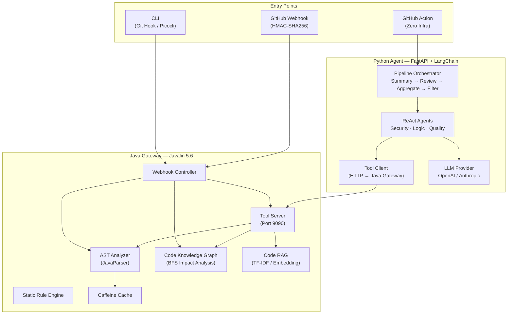

<div align="center">

# DiffGuard

**AI-Powered Multi-Agent Intelligent Code Review System**

[](https://adoptium.net/)
[](https://www.python.org/)
[](https://langchain.com/)
[](LICENSE)
[](CONTRIBUTING.md)

**English** | [中文](README.zh-CN.md)

DiffGuard combines deep code understanding (AST analysis, code knowledge graph, semantic search) with LLM-powered multi-agent review to deliver production-grade, context-aware code reviews.

[Architecture](#architecture) · [Quick Start](#quick-start) · [Features](#core-features) · [Deployment](#deployment) · [Contributing](#contributing)

</div>

---

## Why DiffGuard

Generic LLM code reviewers lack project context — they see a diff but not the codebase behind it. DiffGuard bridges this gap with a **Gateway + Agent** architecture where the Java Gateway provides deep code intelligence tools that LLM agents invoke during review.

| Pain Point | DiffGuard Solution |
|---|---|
| LLM reviews lack project context | AST analysis + Code Knowledge Graph + Code RAG for semantic understanding |
| High false-positive rate | Two-stage filter: regex rules (zero LLM cost) + optional LLM verification |
| Expensive per-review LLM costs | Static rules pre-filter before model invocation; diff summarization reduces token usage |
| Hard to integrate | CLI (Git Hook) · Server (GitHub Webhook) · CI (GitHub Action) — three deployment modes |
| One-size-fits-all review depth | Three review modes: Simple · Pipeline · Multi-Agent |

---

## Core Features

### Three Review Modes

| Mode | Architecture | Best For |
|---|---|---|
| **Simple** | Single LLM call via Java Gateway | Quick checks, trivial changes |
| **Pipeline** | 4-stage pipeline with parallel domain reviewers | Regular PRs, day-to-day reviews |
| **Multi-Agent** | Autonomous ReAct agents with tool calling | Security-sensitive code, complex changes |

### 4-Stage Review Pipeline

```
Diff → Summary → Parallel Review → Aggregation → False Positive Filter → Report
         ▲            ▲                ▲                ▲
    (LLM Summary)  (Security/Logic/  (Dedup + Line   (Regex Rules +
                    Quality)         Number Mapping)  LLM Verification)
```

**Summary Stage** — LLM extracts change overview, risk level (1-5), and routes files to specialized reviewers.

**Reviewer Stage** — Security / Logic / Quality reviewers run in parallel (`asyncio.gather`). Each reviewer can optionally run as a ReAct agent with 6 code intelligence tools.

**Aggregation Stage** — Deduplicates issues, maps diff-context line numbers to actual file line numbers, enforces token budget (`MAX_TOTAL_ISSUES = 50`).

**False Positive Filter** — Two-stage: regex hard rules (zero LLM cost) filter common noise patterns; optional LLM verification for borderline cases.

### Deep Code Understanding

| Capability | Implementation | Details |
|---|---|---|
| **AST Analysis** | JavaParser | Methods, call edges, control flow, field access, data flow — extracted per file |
| **Code Knowledge Graph** | BFS-based graph engine | Nodes: File/Class/Interface/Method. Edges: CALLS/EXTENDS/IMPLEMENTS/IMPORTS/CONTAINS. Impact analysis via BFS with `maxDepth` |
| **Code RAG** | Multi-granularity slicer + vector store | TF-IDF (zero dependency) or OpenAI Embedding. In-memory or Redis-backed vector store |
| **6 Agent Tools** | LangChain `@tool` via Java Tool Server | File content, diff context, method definition, call graph, related files, semantic search |

### Production-Grade Engineering

| Area | Implementation |
|---|---|
| **Security** | HMAC-SHA256 webhook verification, path traversal prevention (`FileAccessSandbox`), session-based tool access with UUID v4 + 10min TTL |
| **Resilience** | Graceful degradation chain: Multi-Agent → Pipeline → Simple → Static Rules. Circuit breaker with `CallerRunsPolicy` back-pressure |
| **Performance** | Caffeine AST cache (content-hash keyed), diff chunking for large PRs (`MAX_FILES_PER_CHUNK=10`), parallel reviewer execution |
| **Observability** | Token usage tracking per stage, structured logging with `request_id` propagation, Prometheus metrics endpoint |
| **Multi-Model** | OpenAI / Anthropic / any OpenAI-compatible provider. Configurable via YAML + environment variables |

---

## Architecture



### Data Flow

1. **Webhook / CLI** triggers a review request
2. **Java Gateway** collects diff via JGit, builds AST and CodeGraph
3. **Python Agent** receives request with diff entries + tool server URL
4. **Summary Stage** — LLM summarizes changes and assigns risk level
5. **Reviewer Stage** — Security/Logic/Quality reviewers run in parallel; each invokes tools (file content, call graph, semantic search) as needed
6. **Aggregation Stage** — merges, deduplicates, maps line numbers
7. **False Positive Filter** — regex rules + optional LLM verification
8. **Result** posted as PR review comments via GitHub API

---

## Quick Start

### Prerequisites

- Java 21 (Eclipse Temurin recommended)
- Maven 3.9+
- Python 3.12+ (Agent service only)
- LLM API Key (OpenAI, Anthropic, or compatible)

### CLI in 30 Seconds

```bash
git clone https://github.com/kunxing/diffguard.git
cd diffguard

# Build Java Gateway
cd services/gateway && mvn clean package -DskipTests && cd ../..

# Set your LLM API key
export DIFFGUARD_API_KEY="sk-your-api-key"

# Review staged changes
java -jar services/gateway/target/diffguard-*.jar review --staged
```

### GitHub Action (Zero Infrastructure)

Add to your workflow YAML:

```yaml
- name: DiffGuard Code Review
  uses: kunxing/diffguard-action@v2
  with:
    api_key: ${{ secrets.DIFFGUARD_API_KEY }}
    review_mode: pipeline  # or: simple, multi_agent
```

---

## Deployment

### CLI Mode (Local Development)

```bash
# Build
cd services/gateway
mvn clean package

# Install Git Hook (auto-review on commit/push)
java -jar target/diffguard-*.jar install

# Review commands
java -jar target/diffguard-*.jar review --staged                # Staged changes
java -jar target/diffguard-*.jar review --from main --to feature  # Branch diff
java -jar target/diffguard-*.jar review --staged --pipeline      # Pipeline mode
java -jar target/diffguard-*.jar review --staged --multi-agent   # Deep review

# Uninstall
java -jar target/diffguard-*.jar uninstall
```

### Server Mode (Docker Compose)

```bash
export DIFFGUARD_API_KEY="sk-your-api-key"
export DIFFGUARD_WEBHOOK_SECRET="your-webhook-secret"
export DIFFGUARD_GITHUB_TOKEN="ghp-your-token"

docker compose up -d
```

| Service | URL |
|---|---|
| Webhook Receiver | `http://localhost:8080/webhook/github` |
| Tool Server | `http://localhost:9090` |
| Agent API | `http://localhost:8000/api/v1/health` |

---

## Configuration

Create `.diffguard.yml` in your project root:

```yaml
llm:
  provider: openai           # openai | anthropic
  model: gpt-4o              # or: claude-sonnet-4-6
  api_key_env: DIFFGUARD_API_KEY
  temperature: 0.1
  max_tokens: 16384

rules:
  enabled: [security, bug-risk, code-style, performance]
  severity_threshold: info

review:
  max_diff_files: 20
  max_tokens_per_file: 4000
```

### Environment Variables

| Variable | Description | Required |
|---|---|---|
| `DIFFGUARD_API_KEY` | LLM API Key | Yes |
| `DIFFGUARD_API_BASE_URL` | Custom API endpoint (for proxies) | No |
| `DIFFGUARD_WEBHOOK_SECRET` | Webhook HMAC secret | Server mode |
| `DIFFGUARD_GITHUB_TOKEN` | GitHub Token (for PR comments) | Server mode |
| `DIFFGUARD_TOOL_SECRET` | Tool Server auth secret | Server mode |

---

## Project Structure

```
services/
├── gateway/                              # Java Gateway (Javalin 5.6)
│   └── src/main/java/com/diffguard/
│       ├── DiffGuard.java                # Main entry (CLI + Server)
│       ├── adapter/
│       │   ├── webhook/                  # GitHub Webhook: HMAC verification, rate limiting
│       │   └── toolserver/               # Tool Server: session management, REST endpoints
│       ├── domain/
│       │   ├── agent/                    # Agent tools: sandbox, registry, 6 tool definitions
│       │   │   └── tools/                # FileAccessSandbox, GetCallGraphTool, SemanticSearchTool...
│       │   ├── ast/                      # JavaParser AST analysis + SPI multi-language extension
│       │   │   ├── model/                # ASTAnalysisResult, MethodInfo, CallEdge, DataFlowNode...
│       │   │   └── spi/                  # LanguageASTProvider SPI interface
│       │   ├── codegraph/                # Code Knowledge Graph: BFS impact analysis, shortest path
│       │   └── coderag/                  # Code RAG: slicing, TF-IDF / OpenAI Embedding, vector store
│       ├── infrastructure/
│       │   ├── config/                   # Three-layer config loading
│       │   ├── git/                      # JGit diff collection
│       │   └── common/                   # TokenEstimator, JacksonMapper
│       └── pom.xml                       # Maven build (shade plugin fat JAR)
│
└── agent/                                # Python Agent (FastAPI + LangChain)
    └── app/
        ├── main.py                       # FastAPI entry + Uvicorn
        ├── config.py                     # Settings (env-based)
        ├── agent/
        │   ├── pipeline_orchestrator.py  # Pipeline orchestration + auto-chunking
        │   ├── llm_utils.py              # Multi-provider LLM factory + retry
        │   ├── false_positive_filter.py  # Two-stage FP filter (regex + LLM)
        │   ├── diff_parser.py            # Diff line number mapper
        │   └── pipeline/
        │       └── stages/
        │           ├── summary.py        # Stage 1: LLM diff summarization
        │           ├── reviewer.py       # Stage 2: Parallel domain reviewers (ReAct)
        │           ├── aggregation.py    # Stage 3: Merge, dedup, line mapping
        │           └── false_positive_filter.py  # Stage 4: FP filtering
        ├── tools/
        │   ├── tool_client.py            # HTTP client for Java Tool Server
        │   └── definitions.py            # LangChain @tool factory functions
        ├── models/
        │   └── schemas.py                # Pydantic v2 request/response models
        ├── llm/prompts/
        │   ├── pipeline/                 # Pipeline stage prompts (system + user)
        │   └── reviewagents/             # Multi-Agent domain prompts
        ├── config/
        │   └── false_positive_rules.yaml # Regex-based FP rules
        └── metrics.py                    # Review metrics tracking
```

---

## Engineering Highlights

### Hexagonal Architecture (Gateway)

The Java Gateway follows strict hexagonal architecture with dependency inversion:
- `domain/` layer has **zero external dependencies** (JDK only)
- `infrastructure/` implements `domain` interfaces
- `adapter/` handles inbound HTTP (webhook, tool server)
- All cross-layer communication through interfaces, never concrete implementations

### Code Knowledge Graph

Built from AST analysis results, the graph supports:
- **4 node types**: FILE, CLASS, INTERFACE, METHOD
- **5 edge types**: CALLS, EXTENDS, IMPLEMENTS, IMPORTS, CONTAINS
- **BFS impact analysis**: `computeImpactSet(changedNodes, maxDepth)` traces blast radius
- **Shortest path**: `findShortestPath(from, to)` for dependency chain analysis
- Thread-safe build-then-read pattern with immutable views

### ReAct Agent with Tool Calling

Each domain reviewer can operate as a LangChain ReAct agent:
1. LLM receives diff + system prompt
2. Agent autonomously calls tools (file content, call graph, semantic search) to investigate
3. Agent produces structured JSON output
4. Fallback parser handles non-JSON responses (regex extraction → LLM re-parse)

### Graceful Degradation Chain

```
Multi-Agent (Python ReAct) → Pipeline (Python) → Simple (Java direct LLM) → Static Rules
```

At each level, failure automatically falls through to the next simpler strategy, ensuring reviews always produce results.

### False Positive Filter

Two-stage pipeline for cost-effective noise reduction:
1. **Regex hard rules** (zero LLM cost): Pattern-based exclusion from configurable YAML rules
2. **LLM verification** (optional): Borderline cases sent for LLM second opinion with confidence threshold

### Diff Chunking for Large PRs

When a PR touches > 10 files or > 60K characters, the pipeline automatically:
1. Splits diff into chunks respecting both file count and character budget
2. Runs the full 4-stage pipeline per chunk with a shared tool session
3. Merges and deduplicates issues across all chunks

---

## Technology Stack

| Layer | Technology | Version |
|---|---|---|
| **Gateway** | Java (Javalin, Picocli, JavaParser, JGit) | 21 |
| **Agent** | Python (FastAPI, LangChain, Pydantic v2) | 3.12 |
| **AST** | JavaParser + SPI multi-language extension | 3.26 |
| **Graph** | Custom BFS engine | — |
| **RAG** | TF-IDF / OpenAI Embedding + InMemory/Redis vector store | — |
| **Cache** | Caffeine (content-hash keyed) | 3.1 |
| **HTTP** | Javalin (Gateway), httpx async (Agent) | — |
| **Build** | Maven (shade plugin), uv (Python) | — |
| **Container** | Docker Compose (non-root, health checks) | — |
| **CI** | GitHub Actions (Java 21 + Python 3.12 matrix) | — |
| **Testing** | JUnit 5 + Mockito (Java), pytest + pytest-asyncio (Python) | — |

---

## Contributing

```bash
# Java development
cd services/gateway
mvn clean verify           # Build + test + coverage

# Python development
cd services/agent
uv sync --dev               # Install with dev dependencies
uv run pytest tests/ -v     # Run tests
uv run ruff check app/ tests/  # Lint
```

Pull requests are welcome. Please describe the change and motivation in detail.

See [JAVA.md](JAVA.md) and [PYTHON.md](PYTHON.md) for engineering standards.

---

## License

[MIT License](LICENSE)
