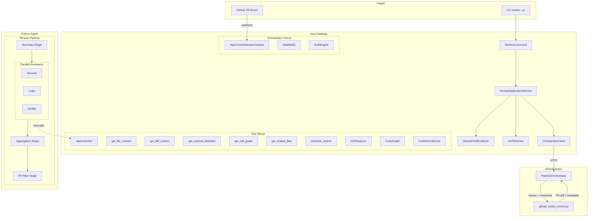
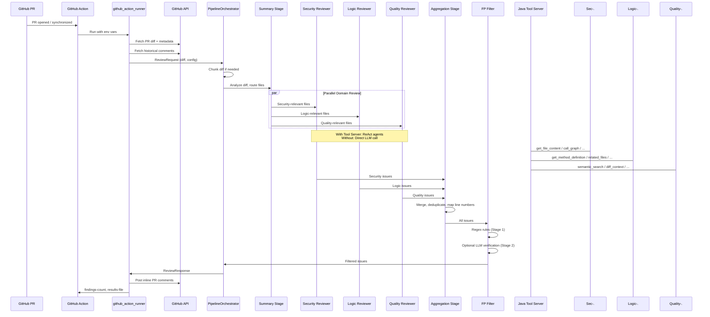

<p align="center">
  
</p>

<h1 align="center">DiffGuard</h1>

<p align="center">
  <strong>AI-Powered Multi-Pipeline Code Review — Security, Logic, Quality, One Action.</strong>
</p>

<p align="center">
  <a href="./README.zh-CN.md">中文</a> | English
</p>

<p align="center">
  
  
  
  
  
  <!-- release-badge:start -->
  <a href="./releases/tag/v1.0.0"></a>
  <!-- release-badge:end -->
</p>

---

## What is DiffGuard?

DiffGuard is an AI code review engine that analyzes pull requests through a **multi-stage pipeline** with parallel domain reviewers (security, logic, quality). It runs as a **GitHub Action** with zero infrastructure requirements, or as a standalone **CLI / Docker service** for advanced deployments.

Unlike rule-only linters, DiffGuard uses LLM-powered deep analysis with optional **tool-calling agents** that can read source files, traverse call graphs, and perform semantic code search — giving reviewers the same context a human reviewer would have.

---

## Key Features

### Multi-Stage Review Pipeline
4-stage orchestrated pipeline: **Summary → Parallel Reviewers → Aggregation → False-Positive Filter**. Each stage is composable and configurable via YAML.

### Parallel Domain Reviewers
Three specialized reviewers run concurrently:
- **Security** — injection, auth, data exposure, crypto, XSS, SSRF
- **Logic** — null safety, concurrency, resource management, data consistency
- **Quality** — complexity, error handling, maintainability, best practices

### Tool-Calling ReAct Agents
When Java Tool Server is enabled, reviewers become **LangChain ReAct agents** with 6 tools:
- `get_file_content` — read project source files
- `get_diff_context` — query diff summary or per-file content
- `get_method_definition` — extract method signatures via AST
- `get_call_graph` — traverse caller/callee/impact relationships
- `get_related_files` — find dependent and related files
- `semantic_search` — vector-based code search (TF-IDF or OpenAI embeddings)

### False-Positive Filter
Two-stage filter: **deterministic regex rules** (zero LLM cost) followed by optional **LLM verification**. 28 built-in precedent rules covering Spring, MyBatis, React, JPA, and more.

### Static Rule Engine (Zero LLM Cost)
Pre-review rules that scan added lines for: SQL injection patterns, hardcoded secrets, dangerous function calls, excessive nesting depth.

### Token-Aware Diff Chunking
Large PRs are automatically split into chunks using first-fit-decreasing packing with hunk-level splitting. Issues are deduplicated across chunks.

### Multi-Model Support
- **Claude** — via Anthropic API (native)
- **OpenAI** — GPT-4o, GPT-5, and compatible endpoints
- **Proxies** — automatic detection and fallback for OpenAI-compatible proxies

### GitHub Action (Composite Action)
Drop-in GitHub Action with PR inline comments, severity icons, and review summaries. Outputs `findings-count` for downstream workflow gates.

### Resilience & Observability
- Circuit breaker (Resilience4j) for LLM and Agent calls
- Rate limiter (10 req/s token bucket)
- Retry with exponential backoff and jitter
- Prometheus metrics (review count, issue count, token usage, duration)
- Review caching (Caffeine + disk, 24h TTL)

---

## Architecture



---

## Project Structure

```
DiffGuard/
├── action.yml                          # GitHub Composite Action definition
├── docker-compose.yml                  # Full stack: Gateway + Agent + RabbitMQ
├── services/
│   ├── gateway/                        # Java 21 Gateway (Maven)
│   │   ├── pom.xml                     # Dependencies: Javalin, JavaParser, Resilience4j, ...
│   │   ├── Dockerfile                  # eclipse-temurin:21-jre
│   │   ├── .env.example
│   │   └── src/main/java/com/diffguard/
│   │       ├── cli/                    # CLI entry: review, install, uninstall, tool-server, orchestrator-server
│   │       ├── review/                 # Review orchestration, caching, engine factory
│   │       │   ├── ast/                # AST analysis (JavaParser), cache, SPI
│   │       │   ├── codegraph/          # Code knowledge graph (nodes + edges)
│   │       │   ├── coderag/            # Semantic search (TF-IDF / OpenAI + ChromaDB)
│   │       │   ├── rules/              # Static rule engine (SQL injection, secrets, ...)
│   │       │   └── model/              # ReviewIssue, ReviewResult, Severity, DiffFileEntry
│   │       ├── agent/tools/            # Tool implementations for Tool Server
│   │       ├── orchestrator/           # Orchestrator REST API + RabbitMQ dispatch
│   │       ├── toolserver/             # Tool Server HTTP endpoints + session management
│   │       ├── platform/
│   │       │   ├── llm/                # LLM client, Claude/OpenAI providers, batch executor
│   │       │   ├── config/             # Three-layer config loader (project → home → template)
│   │       │   ├── git/                # GitHub PR diff collector + local JGit diff
│   │       │   ├── prompt/             # Prompt template builder + loader
│   │       │   ├── messaging/          # RabbitMQ topology + task publisher
│   │       │   ├── resilience/         # Circuit breaker, rate limiter, retry (Resilience4j)
│   │       │   ├── observability/      # Micrometer + Prometheus metrics
│   │       │   └── output/             # Terminal UI, Markdown formatter, progress display
│   │       └── exception/              # Domain exceptions
│   │
│   └── agent/                          # Python 3.11+ Agent
│       ├── pyproject.toml              # FastAPI, LangChain, httpx, ChromaDB, ...
│       ├── Dockerfile                  # python:3.12-slim + uv
│       ├── .env.example
│       ├── config/
│       │   └── false-positive-rules.yaml  # 14 exclusion rules + 28 precedent rules
│       ├── scripts/
│       │   └── e2e_review.ps1          # End-to-end review test script
│       └── src/diffguard_agent/
│           ├── main.py                 # FastAPI app: /health, /review
│           ├── config.py               # Settings from environment variables
│           ├── github_action_runner.py # Standalone Action entry (no server needed)
│           ├── github_api.py           # Sync GitHub client (Action mode)
│           ├── github/                 # Async GitHub client + comment builders
│           ├── agent/
│           │   ├── pipeline_orchestrator.py  # Chunking + 4-stage pipeline
│           │   ├── diff_parser.py      # Diff → file line number mapping
│           │   ├── llm_utils.py        # LLM factory, retry, error classification
│           │   ├── false_positive_filter.py  # Two-stage FP filter
│           │   └── pipeline/
│           │       ├── pipeline-config.yaml   # Pipeline DSL config
│           │       ├── pipeline_config.py     # YAML pipeline loader
│           │       └── stages/
│           │           ├── summary.py         # Stage 1: diff summary + file routing
│           │           ├── reviewer.py        # Stage 2: parallel domain reviewers
│           │           ├── aggregation.py     # Stage 3: merge + deduplicate + line mapping
│           │           ├── fp_filter_stage.py # Stage 4: false-positive filter
│           │           └── static_rules.py    # Zero-cost regex pre-review
│           ├── llm/prompts/pipeline/   # Domain-specific prompt templates
│           │   ├── security-system.txt, security-user.txt
│           │   ├── logic-system.txt, logic-user.txt
│           │   ├── quality-system.txt, quality-user.txt
│           │   ├── aggregation-system.txt, aggregation-user.txt
│           │   ├── diff-summary-system.txt, diff-summary-user.txt
│           │   └── react-user.txt
│           ├── models/schemas.py       # Pydantic request/response models
│           ├── tools/                  # LangChain tool factories → Java Tool Server
│           ├── utils/                  # Diff splitting utilities
│           └── metrics.py             # Per-stage metrics collector
└── .github/workflows/
    ├── ci.yml                          # Java mvn verify + Python pytest
    ├── diffguard-review.yml            # Auto PR review
    └── diffguard-manual-test.yml       # Manual review trigger
```

---

## Quick Start

### Option 1: GitHub Action (Recommended)

Create `.github/workflows/diffguard-review.yml` in your repository:

```yaml
name: DiffGuard Review
on:
  pull_request:
    types: [opened, synchronize, reopened, ready_for_review]

jobs:
  review:
    runs-on: ubuntu-latest
    steps:
      - uses: actions/checkout@v4
      - uses: DiffGuard/diffguard@main
        with:
          api-key: ${{ secrets.DIFFGUARD_API_KEY }}
          provider: claude
          model: claude-sonnet-4-20250514
          language: en
          comment-pr: true
          enable-fp-filter: true
```

Add your API key as a repository secret (`DIFFGUARD_API_KEY`).

### Option 2: CLI (Local)

Prerequisites: Java 21, Maven 3.9+

```bash
# Clone and build
git clone https://github.com/Eleven-Mouse/DiffGuard.git
cd DiffGuard/services/gateway
mvn -DskipTests package

# Run review
export GITHUB_TOKEN=ghp_your_token
export DIFFGUARD_API_KEY=sk-ant-your-key
java -jar target/diffguard-1.0.0.jar review --pr owner/repo#123 --pipeline

# Multi-Agent 兼容入口（当前与 Pipeline 同链路）
java -jar target/diffguard-1.0.0.jar review --pr owner/repo#123 --multi-agent

# 有严重问题也强制通过
java -jar target/diffguard-1.0.0.jar review --pr owner/repo#123 --force

# 安装 Git Hook（pre-commit + pre-push，自动审查）
java -jar target/diffguard-1.0.0.jar install

# 卸载 Hook
java -jar target/diffguard-1.0.0.jar uninstall

# 启动独立 Tool 服务（微服务拆分场景）
java -jar target/diffguard-1.0.0.jar tool-server --port 9090

# 启动独立 Review Orchestrator 服务（第二阶段）
java -jar target/diffguard-1.0.0.jar orchestrator-server --port 8088
```

安装 Git Hook 后，每次 `git commit` 或 `git push` 将自动触发代码审查。
  
> Hook 仅支持 PR 模式。请提前设置 `DIFFGUARD_PR=owner/repo#number`，未设置时 Hook 会跳过审查。

### GitHub Action（零基础设施）

在 workflow YAML 中添加：

```yaml
permissions:
  contents: read
  pull-requests: write

- name: DiffGuard Code Review
  uses: kunxing/diffguard@v1
  with:
    api-key: ${{ secrets.DIFFGUARD_API_KEY }}
    provider: claude
    model: claude-sonnet-4-20250514
    language: zh
    comment-pr: true
    exclude-directories: "docs,examples"
    enable-fp-filter: true
    timeout-minutes: 10
    # 可选：启用 Java Tool Server（让 Agent 在审查时调用 AST/调用图/语义检索工具）
    use-java-tool-server: true
    tool-server-url: http://127.0.0.1:9090
```

### Option 3: Docker Compose

```bash
git clone https://github.com/Eleven-Mouse/DiffGuard.git
cd DiffGuard

# Configure
cp services/gateway/.env.example services/gateway/.env
# Edit .env with your API keys

# Start all services
docker compose up -d
```

This starts:
- **RabbitMQ** on ports 5672/15672
- **Gateway** (Tool Server on 9090, Metrics on 9091)
- **Agent** on port 8000

---

## Configuration

### GitHub Action Inputs

| Input | Default | Description |
|---|---|---|
| `api-key` | *(required)* | LLM API key (Anthropic or OpenAI) |
| `provider` | `claude` | LLM provider: `claude` or `openai` |
| `model` | `claude-sonnet-4-20250514` | Model name |
| `api-base-url` | *(empty)* | Custom API endpoint (for proxies) |
| `language` | `zh` | Output language: `zh` or `en` |
| `comment-pr` | `true` | Post inline PR comments |
| `exclude-directories` | *(empty)* | Comma-separated dirs to exclude |
| `enable-fp-filter` | `true` | Enable false-positive filtering |
| `timeout-minutes` | `10` | Review timeout |
| `use-java-tool-server` | `false` | Enable tool-calling agents |
| `tool-server-url` | `http://127.0.0.1:9090` | Tool Server URL |

### Environment Variables

#### Java Gateway

| Variable | Description |
|---|---|
| `DIFFGUARD_API_KEY` | LLM API key |
| `DIFFGUARD_API_BASE_URL` | Custom LLM API base URL |
| `DIFFGUARD_AGENT_URL` | Python Agent service URL |
| `DIFFGUARD_TOOL_SERVER_URL` | Tool Server URL (overrides host+port) |
| `DIFFGUARD_TOOL_SERVER_HOST` | Tool Server host (default: `0.0.0.0`) |
| `DIFFGUARD_TOOL_SERVER_PORT` | Tool Server port (default: `9090`) |
| `DIFFGUARD_TOOL_SECRET` | Shared secret for Tool Server auth |
| `DIFFGUARD_ORCHESTRATOR_URL` | Orchestrator Server URL |
| `GITHUB_TOKEN` / `GH_TOKEN` / `DIFFGUARD_GITHUB_TOKEN` | GitHub API token (any one) |
| `RABBITMQ_HOST` / `PORT` / `USER` / `PASSWORD` | RabbitMQ connection |

#### Python Agent

| Variable | Description |
|---|---|
| `DIFFGUARD_PROVIDER` | `claude` or `openai` |
| `DIFFGUARD_MODEL` | Model name |
| `DIFFGUARD_API_KEY` | LLM API key |
| `DIFFGUARD_API_BASE_URL` | Custom API endpoint |
| `DIFFGUARD_LANGUAGE` | `zh` or `en` |
| `DIFFGUARD_COMMENT_PR` | `true` / `false` |
| `DIFFGUARD_ENABLE_FP_FILTER` | Enable FP filter |
| `DIFFGUARD_TIMEOUT_MINUTES` | Review timeout |
| `DIFFGUARD_USE_JAVA_TOOL_SERVER` | Enable tool calls |
| `DIFFGUARD_TOOL_SERVER_URL` | Tool Server URL |
| `DIFFGUARD_EXCLUDE_DIRS` | Comma-separated excluded dirs |
| `GITHUB_TOKEN` | GitHub API token |
| `GITHUB_REPOSITORY` | `owner/repo` format |
| `PR_NUMBER` | PR number to review |

---

## Review Workflow



---

## Deployment

### Docker Compose (Production)

```bash
docker compose up -d
```

The `docker-compose.yml` provides:
- **RabbitMQ** — async task dispatch between Gateway and Agent
- **diffguard-gateway** — Tool Server (9090, localhost-only) + Metrics (9091)
- **diffguard-agent** — FastAPI review service (8000)
- Shared `diffguard-net` bridge network
- Health checks on all services
- Named volume for RabbitMQ data persistence

### Standalone Services

```bash
# Start Tool Server only
java -jar diffguard-1.0.0.jar tool-server --port 9090

# Start Orchestrator Server only
java -jar diffguard-1.0.0.jar orchestrator-server --port 8088

# Start Python Agent API
cd services/agent
python -m diffguard_agent.main
```

---

## Development

### Build & Test (Java)

```bash
cd services/gateway
mvn verify          # Build + test
mvn test            # Test only
mvn -DskipTests package  # Skip tests
```

### Build & Test (Python)

```bash
cd services/agent
uv sync --dev       # Install with dev deps
pytest              # Run tests
ruff check .        # Lint (optional)
```

### CI

The project runs CI on every push/PR to `main`:
- **Java**: `mvn -B verify` with Surefire report upload
- **Python**: `uv sync --dev` → `ruff check` → `pytest`

---

## Tech Stack

| Layer | Technology |
|---|---|
| **Gateway** | Java 21, Maven, Javalin (HTTP), picocli (CLI) |
| **Agent** | Python 3.11+, FastAPI, LangChain, Pydantic, httpx |
| **LLM** | Claude (Anthropic API), OpenAI (Chat Completions) |
| **AST** | JavaParser (Java source analysis) |
| **Code Graph** | Custom graph engine (nodes: FILE/CLASS/METHOD, edges: CALLS/IMPLEMENTS/EXTENDS) |
| **Code RAG** | TF-IDF / OpenAI Embeddings + ChromaDB |
| **Caching** | Caffeine (in-memory) + disk persistence |
| **Messaging** | RabbitMQ (async task dispatch) |
| **Resilience** | Resilience4j (circuit breaker, rate limiter, retry) |
| **Observability** | Micrometer + Prometheus |
| **Container** | Docker, Docker Compose |
| **CI/CD** | GitHub Actions |

---

## Roadmap

Based on the project's [PROGRESS.md](./PROGRESS.md):

- [x] Tool Service extraction (standalone Tool Server)
- [x] Pipeline orchestrator with 4-stage review
- [x] False-positive filter with regex + LLM verification
- [x] GitHub Action composite action
- [x] RabbitMQ task dispatch
- [x] ChromaDB vector store for Code RAG
- [x] AST analysis + Code Graph
- [ ] Orchestrator Service full MQ integration testing
- [ ] RAG adapter PoC (external embedding providers)
- [ ] Rule/Result Service extraction

---

## Contributing

Contributions are welcome! Please feel free to submit a Pull Request.

1. Fork the repository
2. Create your feature branch (`git checkout -b feature/amazing-feature`)
3. Commit your changes
4. Push to the branch (`git push origin feature/amazing-feature`)
5. Open a Pull Request

Please ensure tests pass (`mvn verify` for Java, `pytest` for Python) before submitting.

---

## License

This project is licensed under the MIT License — see the [LICENSE](./LICENSE) file for details.
