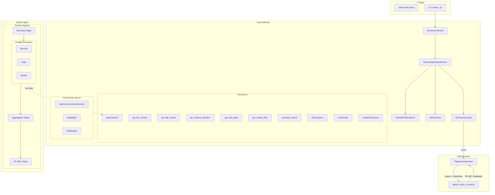
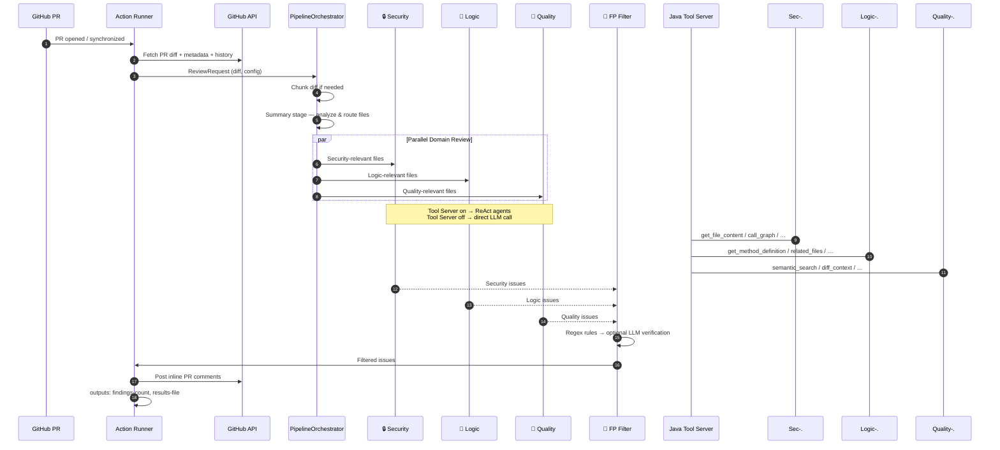

<div align="center">


<!-- typewriter tagline -->
<a href="https://github.com/Eleven-Mouse/Diffguard">
  
</a>

[](#tech-stack)
[](#tech-stack)
[](#tech-stack)
[](#multi-model-support)
[](#license)
[](#contributing)
<!-- release-badge:start -->
[](./releases/tag/v1.0.0)
<!-- release-badge:end -->

[中文](./README.zh-CN.md) | English

**4 阶段流水线 · 3 位并行领域审查员 · 6 个工具调用 · 28 条误报规则 · 0 基础设施**

[🚀 Quick Start](#-quick-start) · [✨ Features](#-key-features) · [🏛 Architecture](#-architecture) · [⚙️ Configuration](#️-configuration) · [🚢 Deployment](#-deployment) · [🧰 Development](#-development) · [🧑‍💻 Contributing](#-contributing)

</div>

---

## 🤔 Why DiffGuard?

| | Traditional Linters | Generic LLM Bots | **DiffGuard** |
|---|:---:|:---:|:---:|
| Understands *your* codebase context | ❌ | ⚠️ shallow | ✅ **AST + Call Graph + RAG** |
| Parallel domain-specialized reviewers | ❌ | ❌ | ✅ **Security / Logic / Quality** |
| False-positive filtering | ❌ noisy | ❌ noisy | ✅ **Regex + LLM two-stage** |
| Zero-cost static pre-scan | ✅ | ❌ | ✅ **Secrets / SQLi / `eval` regex** |
| Survives huge PRs | ✅ | ❌ token blowup | ✅ **Token-aware FFD chunking** |
| Production resilience | n/a | ❌ | ✅ **Circuit breaker + retry + rate limit** |

> Unlike rule-only linters, DiffGuard uses LLM-powered deep analysis with optional **tool-calling ReAct agents** that read source files, traverse call graphs, and perform semantic code search — giving reviewers the same context a human reviewer would have.

---

## ✨ Key Features

<div align="center">

| 🛡️ **Security** | 🧠 **Logic** | 🧹 **Quality** |
|:---:|:---:|:---:|
| Injection · Auth · Data exposure | Null safety · Concurrency | Complexity · Error handling |
| Crypto · XSS · SSRF | Resource mgmt · Data consistency | Maintainability · Best practices |

</div>

### 🔀 Multi-Stage Review Pipeline
A 4-stage orchestrated pipeline — **Summary → Parallel Reviewers → Aggregation → False-Positive Filter** — fully composable and configurable via YAML DSL.

### 🤖 Tool-Calling ReAct Agents
When the Java Tool Server is enabled, reviewers become **LangChain ReAct agents** with 6 context tools:

| Tool | What it gives the reviewer |
|---|---|
| `get_file_content` | Read any project source file |
| `get_diff_context` | Diff summary or per-file content |
| `get_method_definition` | Method signatures via AST |
| `get_call_graph` | Caller / callee / impact traversal |
| `get_related_files` | Dependent & related files |
| `semantic_search` | Vector code search (TF-IDF or OpenAI embeddings) |

### 🧯 False-Positive Filter
Two-stage: **deterministic regex rules** (zero LLM cost) → optional **LLM verification**. **28 built-in precedent rules** covering Spring, MyBatis, React, JPA, and more.

### 📡 Static Rule Engine (Zero LLM Cost)
Pre-review rules scan added lines for SQL injection patterns, hardcoded secrets (AWS keys, GitHub tokens), dangerous calls (`Runtime.exec`, `eval`), and excessive nesting depth.

### ✂️ Token-Aware Diff Chunking
Large PRs auto-split via **first-fit-decreasing packing** with hunk-level splitting (max 10 files / 60K chars / 12K tokens per chunk). Issues are deduplicated across chunks.

### 🌐 Multi-Model Support
**Claude** (native Anthropic API) · **OpenAI** (GPT-4o, GPT-5 & compatible endpoints) · **Proxies** with automatic detection and fallback.

### 🛟 Resilience & Observability
- ⚡ Circuit breaker (Resilience4j) — 50% failure-rate threshold, 30s open state
- 🚦 Rate limiter — 10 req/s token bucket
- 🔁 Retry with exponential backoff + jitter (3 max attempts)
- 📈 Prometheus metrics — reviews, issues, token usage, duration, static rule hits
- 💾 Review caching — Caffeine + disk, 24h TTL

---

## 🏛 Architecture


```mermaid
graph TB
    subgraph Trigger["⚡ Trigger"]
        PR["GitHub PR Event"]
        CLI["CLI review --pr"]
    end

    subgraph GitHubAction["GitHub Action"]
        AR["github_action_runner.py"]
        AR -->|"PR diff + metadata"| PO
    end

    subgraph Gateway["Java Gateway"]
        RC["ReviewCommand"]
        RAS["ReviewApplicationService"]
        GDC["GitHubPrDiffCollector"]
        AE["ASTEnricher"]
        OCS["OrchestratorClient"]

        RC --> RAS
        RAS --> GDC
        RAS --> AE
        RAS --> OCS

        subgraph ToolServer["Tool Server"]
            TS["/api/v1/tools/*"]
            FC["get_file_content"]
            DC["get_diff_context"]
            MD["get_method_definition"]
            CG["get_call_graph"]
            RF["get_related_files"]
            SS["semantic_search"]
            AST["ASTAnalyzer"]
            KG["CodeGraph"]
            RAG["CodeRAGService"]
        end

        subgraph Orchestrator["Orchestrator Server"]
            OS["/api/v1/orchestrator/reviews"]
            MQ["RabbitMQ"]
            RE["RuleEngine"]
        end
    end

    subgraph Agent["Python Agent"]
        PO["PipelineOrchestrator"]

        subgraph Pipeline["Review Pipeline"]
            S["Summary Stage"]
            subgraph Reviewers["Parallel Reviewers"]
                SEC["Security"]
                LOG["Logic"]
                QAL["Quality"]
            end
            AGG["Aggregation Stage"]
            FPF["FP Filter Stage"]
        end

        S --> Reviewers --> AGG --> FPF
    end

    CLI --> RC
    OCS -->|"HTTP"| PO
    Reviewers -.->|"tool calls"| TS
    PO -->|"issues + comments"| AR
```

### 🔄 Review Workflow


```mermaid
sequenceDiagram
    autonumber
    participant PR as GitHub PR
    participant Runner as Action Runner
    participant GH as GitHub API
    participant Pipeline as PipelineOrchestrator
    participant Sec as 🔒 Security
    participant Logic as 🧠 Logic
    participant Quality as 🧹 Quality
    participant FP as 🧯 FP Filter
    participant ToolSrv as Java Tool Server

    PR->>Runner: PR opened / synchronized
    Runner->>GH: Fetch PR diff + metadata + history
    Runner->>Pipeline: ReviewRequest (diff, config)

    Pipeline->>Pipeline: Chunk diff if needed
    Pipeline->>Pipeline: Summary stage — analyze & route files

    par Parallel Domain Review
        Pipeline->>Sec: Security-relevant files
        Pipeline->>Logic: Logic-relevant files
        Pipeline->>Quality: Quality-relevant files
    end

    Note over Sec,Quality: Tool Server on → ReAct agents<br/>Tool Server off → direct LLM call

    Sec-.->ToolSrv: get_file_content / call_graph / …
    Logic-.->ToolSrv: get_method_definition / related_files / …
    Quality-.->ToolSrv: semantic_search / diff_context / …

    Sec-->>FP: Security issues
    Logic-->>FP: Logic issues
    Quality-->>FP: Quality issues

    FP->>FP: Regex rules → optional LLM verification
    FP->>Runner: Filtered issues
    Runner->>GH: Post inline PR comments
    Runner->>Runner: outputs: findings-count, results-file
```

---

## 🚀 Quick Start

### 🥇 Option 1 — GitHub Action (Recommended)

Drop this into `.github/workflows/diffguard-review.yml`:

```yaml
name: DiffGuard Review
on:
  pull_request:
    types: [opened, synchronize, reopened, ready_for_review]

permissions:
  contents: read
  pull-requests: write

jobs:
  review:
    runs-on: ubuntu-latest
    steps:
      - uses: actions/checkout@v4
      - uses: Eleven-Mouse/Diffguard@v1.0.0
        with:
          api-key: ${{ secrets.DIFFGUARD_API_KEY }}
          provider: claude
          model: claude-sonnet-4-20250514
          language: en
          comment-pr: true
          enable-fp-filter: true
```

Then add your API key as the repository secret `DIFFGUARD_API_KEY`. Done — every PR now gets reviewed. 🎉

### 🥈 Option 2 — CLI (Local)

Prerequisites: Java 21, Maven 3.9+

```bash
# Clone and build
git clone https://github.com/Eleven-Mouse/DiffGuard.git
cd DiffGuard/services/gateway
mvn -DskipTests package

# Run a review
export GITHUB_TOKEN=ghp_your_token
export DIFFGUARD_API_KEY=sk-ant-your-key
java -jar target/diffguard-1.0.0.jar review --pr owner/repo#123 --pipeline

# With Java Tool Server enabled (deep AST / code-graph analysis)
java -jar target/diffguard-1.0.0.jar review --pr owner/repo#123 --pipeline --force

# Install / uninstall Git hooks (pre-commit + pre-push auto-review)
java -jar target/diffguard-1.0.0.jar install
java -jar target/diffguard-1.0.0.jar uninstall

# Standalone servers
java -jar target/diffguard-1.0.0.jar tool-server --port 9090
java -jar target/diffguard-1.0.0.jar orchestrator-server --port 8088
```

> 💡 Git Hook only supports PR mode. Set `DIFFGUARD_PR=owner/repo#number` beforehand; the hook skips review when unset.

### 🥉 Option 3 — Docker Compose

```bash
git clone https://github.com/Eleven-Mouse/DiffGuard.git
cd DiffGuard

# Configure
cp services/gateway/.env.example services/gateway/.env
# Edit .env with your API keys

# Start the full stack
docker compose up -d
```

What you get:

| Service | Ports | Role |
|---|---|---|
| 🐰 RabbitMQ | 5672 / 15672 | Async task dispatch |
| ☕ Gateway | 9090 (Tool Server) · 9091 (Metrics) | AST · CodeGraph · RAG |
| 🐍 Agent | 8000 | FastAPI review pipeline |

---

## ⚙️ Configuration

<details open>
<summary><b>📋 GitHub Action Inputs</b></summary>

| Input | Default | Description |
|---|---|---|
| `api-key` | *(required)* | LLM API key (Anthropic or OpenAI) |
| `provider` | `claude` | `claude` or `openai` |
| `model` | `claude-sonnet-4-20250514` | Model name |
| `api-base-url` | *(empty)* | Custom API endpoint (for proxies) |
| `language` | `zh` | Output language: `zh` or `en` |
| `comment-pr` | `true` | Post inline PR comments |
| `exclude-directories` | *(empty)* | Comma-separated dirs to exclude |
| `enable-fp-filter` | `true` | Enable false-positive filtering |
| `timeout-minutes` | `10` | Review timeout |
| `use-java-tool-server` | `false` | Enable tool-calling agents |
| `tool-server-url` | `http://127.0.0.1:9090` | Tool Server URL |

</details>

<details>
<summary><b>☕ Java Gateway Environment Variables</b></summary>

| Variable | Description |
|---|---|
| `DIFFGUARD_API_KEY` | LLM API key |
| `DIFFGUARD_API_BASE_URL` | Custom LLM API base URL |
| `DIFFGUARD_AGENT_URL` | Python Agent service URL |
| `DIFFGUARD_TOOL_SERVER_URL` | Tool Server URL (overrides host+port) |
| `DIFFGUARD_TOOL_SERVER_HOST` | Tool Server host (default: `localhost`) |
| `DIFFGUARD_TOOL_SERVER_PORT` | Tool Server port (default: `9090`) |
| `DIFFGUARD_TOOL_SECRET` | Shared secret for Tool Server auth |
| `DIFFGUARD_ORCHESTRATOR_URL` | Orchestrator Server URL |
| `GITHUB_TOKEN` / `GH_TOKEN` / `DIFFGUARD_GITHUB_TOKEN` | GitHub API token (any one) |
| `RABBITMQ_HOST` / `PORT` / `USER` / `PASSWORD` | RabbitMQ connection |

</details>

<details>
<summary><b>🐍 Python Agent Environment Variables</b></summary>

| Variable | Description |
|---|---|
| `DIFFGUARD_PROVIDER` | `claude` or `openai` |
| `DIFFGUARD_MODEL` | Model name |
| `DIFFGUARD_API_KEY` | LLM API key |
| `DIFFGUARD_API_BASE_URL` | Custom API endpoint |
| `DIFFGUARD_LANGUAGE` | `zh` or `en` |
| `DIFFGUARD_COMMENT_PR` | `true` / `false` |
| `DIFFGUARD_ENABLE_FP_FILTER` | Enable FP filter |
| `DIFFGUARD_TIMEOUT_MINUTES` | Review timeout |
| `DIFFGUARD_USE_JAVA_TOOL_SERVER` | Enable tool calls |
| `DIFFGUARD_TOOL_SERVER_URL` | Tool Server URL |
| `DIFFGUARD_EXCLUDE_DIRS` | Comma-separated excluded dirs |
| `GITHUB_TOKEN` | GitHub API token |
| `GITHUB_REPOSITORY` | `owner/repo` format |
| `PR_NUMBER` | PR number to review |

</details>

---

## 🗂 Project Structure

<details>
<summary><b>Expand full directory tree</b></summary>

```
DiffGuard/
├── action.yml                          # GitHub Composite Action definition
├── docker-compose.yml                  # Full stack: Gateway + Agent + RabbitMQ
├── services/
│   ├── gateway/                        # Java 21 Gateway (Maven)
│   │   ├── pom.xml                     # Javalin, JavaParser, Resilience4j, ...
│   │   ├── Dockerfile                  # eclipse-temurin:21-jre
│   │   ├── .env.example
│   │   └── src/main/java/com/diffguard/
│   │       ├── cli/                    # CLI: review, install, uninstall, tool-server, orchestrator-server
│   │       ├── review/                 # Review orchestration, caching, engine factory
│   │       │   ├── ast/                # AST analysis (JavaParser), cache, SPI
│   │       │   ├── codegraph/          # Code knowledge graph (nodes + edges)
│   │       │   ├── coderag/            # Semantic search (TF-IDF / OpenAI + ChromaDB)
│   │       │   ├── rules/              # Static rule engine (SQL injection, secrets, ...)
│   │       │   └── model/              # ReviewIssue, ReviewResult, Severity, DiffFileEntry
│   │       ├── agent/tools/            # Tool implementations for Tool Server
│   │       ├── orchestrator/           # Orchestrator REST API + RabbitMQ dispatch
│   │       ├── toolserver/             # Tool Server HTTP endpoints + session management
│   │       ├── platform/
│   │       │   ├── llm/                # LLM client, Claude/OpenAI providers, batch executor
│   │       │   ├── config/             # Three-layer config loader (project → home → template)
│   │       │   ├── git/                # GitHub PR diff collector + local JGit diff
│   │       │   ├── prompt/             # Prompt template builder + loader
│   │       │   ├── messaging/          # RabbitMQ topology + task publisher
│   │       │   ├── resilience/         # Circuit breaker, rate limiter, retry (Resilience4j)
│   │       │   ├── observability/      # Micrometer + Prometheus metrics
│   │       │   └── output/             # Terminal UI, Markdown formatter, progress display
│   │       └── exception/              # Domain exceptions
│   │
│   └── agent/                          # Python 3.12 Agent
│       ├── pyproject.toml              # FastAPI, LangChain, httpx, ChromaDB, ...
│       ├── Dockerfile                  # python:3.12-slim + uv
│       ├── .env.example
│       ├── config/
│       │   └── false-positive-rules.yaml  # 14 exclusion rules + 28 precedent rules
│       ├── scripts/
│       │   └── e2e_review.ps1          # End-to-end review test script
│       └── src/diffguard_agent/
│           ├── main.py                 # FastAPI app: /health, /review
│           ├── config.py               # Settings from environment variables
│           ├── github_action_runner.py # Standalone Action entry (no server needed)
│           ├── github_api.py           # Sync GitHub client (Action mode)
│           ├── github/                 # Async GitHub client + comment builders
│           ├── agent/
│           │   ├── pipeline_orchestrator.py  # Chunking + 4-stage pipeline
│           │   ├── diff_parser.py      # Diff → file line number mapping
│           │   ├── llm_utils.py        # LLM factory, retry, error classification
│           │   ├── false_positive_filter.py  # Two-stage FP filter
│           │   └── pipeline/
│           │       ├── pipeline-config.yaml   # Pipeline DSL config
│           │       ├── pipeline_config.py     # YAML pipeline loader
│           │       └── stages/
│           │           ├── summary.py         # Stage 1: diff summary + file routing
│           │           ├── reviewer.py        # Stage 2: parallel domain reviewers
│           │           ├── aggregation.py     # Stage 3: merge + deduplicate + line mapping
│           │           ├── fp_filter_stage.py # Stage 4: false-positive filter
│           │           └── static_rules.py    # Zero-cost regex pre-review
│           ├── llm/prompts/pipeline/   # Domain-specific prompt templates
│           ├── models/schemas.py       # Pydantic request/response models
│           ├── tools/                  # LangChain tool factories → Java Tool Server
│           ├── utils/                  # Diff splitting utilities
│           └── metrics.py             # Per-stage metrics collector
└── .github/workflows/
    ├── ci.yml                          # Manual CI: Java mvn verify + Python pytest
    ├── diffguard-review.yml            # Auto PR review
    ├── diffguard-manual-test.yml       # Manual review trigger
    └── release.yml                     # Tag-based release pipeline
```

</details>

---

## 🚢 Deployment

<details open>
<summary><b>🐳 Docker Compose (Production)</b></summary>

```bash
docker compose up -d
```

The `docker-compose.yml` provides:
- **RabbitMQ** — async task dispatch between Gateway and Agent
- **diffguard-gateway** — Tool Server (9090, localhost-only) + Metrics (9091)
- **diffguard-agent** — FastAPI review service (8000)
- Shared `diffguard-net` bridge network
- Health checks on all services
- Named volume for RabbitMQ data persistence

</details>

<details>
<summary><b>📦 Standalone Services</b></summary>

```bash
# Start Tool Server only
java -jar diffguard-1.0.0.jar tool-server --port 9090

# Start Orchestrator Server only
java -jar diffguard-1.0.0.jar orchestrator-server --port 8088

# Start Python Agent API
cd services/agent
python -m diffguard_agent.main
```

</details>

---

## 🧰 Development

<details open>
<summary><b>☕ Build & Test (Java)</b></summary>

```bash
cd services/gateway
mvn verify          # Build + test
mvn test            # Test only
mvn -DskipTests package  # Skip tests
```

</details>

<details>
<summary><b>🐍 Build & Test (Python)</b></summary>

```bash
cd services/agent
uv sync --dev       # Install with dev deps
pytest              # Run tests
ruff check .        # Lint (optional)
```

</details>

<details>
<summary><b>🤖 CI</b></summary>

The project provides CI workflows for manual verification:
- **Java**: `mvn -B verify` with Surefire report upload
- **Python**: `uv sync --dev` → `ruff check` → `pytest`

</details>

---

## 🛠 Tech Stack

<div align="center">

| 🧱 Layer | ⚙️ Technology |
|---|---|
| **Gateway** | Java 21 · Maven · Javalin · picocli |
| **Agent** | Python 3.12 · FastAPI · LangChain · Pydantic · httpx |
| **LLM** | Claude (Anthropic API) · OpenAI (Chat Completions) |
| **AST** | JavaParser |
| **Code Graph** | Custom engine (FILE/CLASS/METHOD nodes · CALLS/IMPLEMENTS/EXTENDS edges) |
| **Code RAG** | TF-IDF / OpenAI Embeddings + ChromaDB |
| **Caching** | Caffeine + disk persistence |
| **Messaging** | RabbitMQ |
| **Resilience** | Resilience4j (circuit breaker · rate limiter · retry) |
| **Observability** | Micrometer + Prometheus |
| **Container** | Docker · Docker Compose |
| **CI/CD** | GitHub Actions |

</div>

---

## 🧑‍💻 Contributing

Contributions are welcome! 🎉

1. 🍴 Fork the repository
2. 🌿 Create your feature branch (`git checkout -b feature/amazing-feature`)
3. ✅ Commit your changes
4. ⬆️ Push to the branch (`git push origin feature/amazing-feature`)
5. 🔃 Open a Pull Request

> Please ensure tests pass before submitting — `mvn verify` for Java, `pytest` for Python.

---

## 📄 License

This project is licensed under the MIT License — see the [LICENSE](./LICENSE) file for details.

---

<div align="center">


</div>
