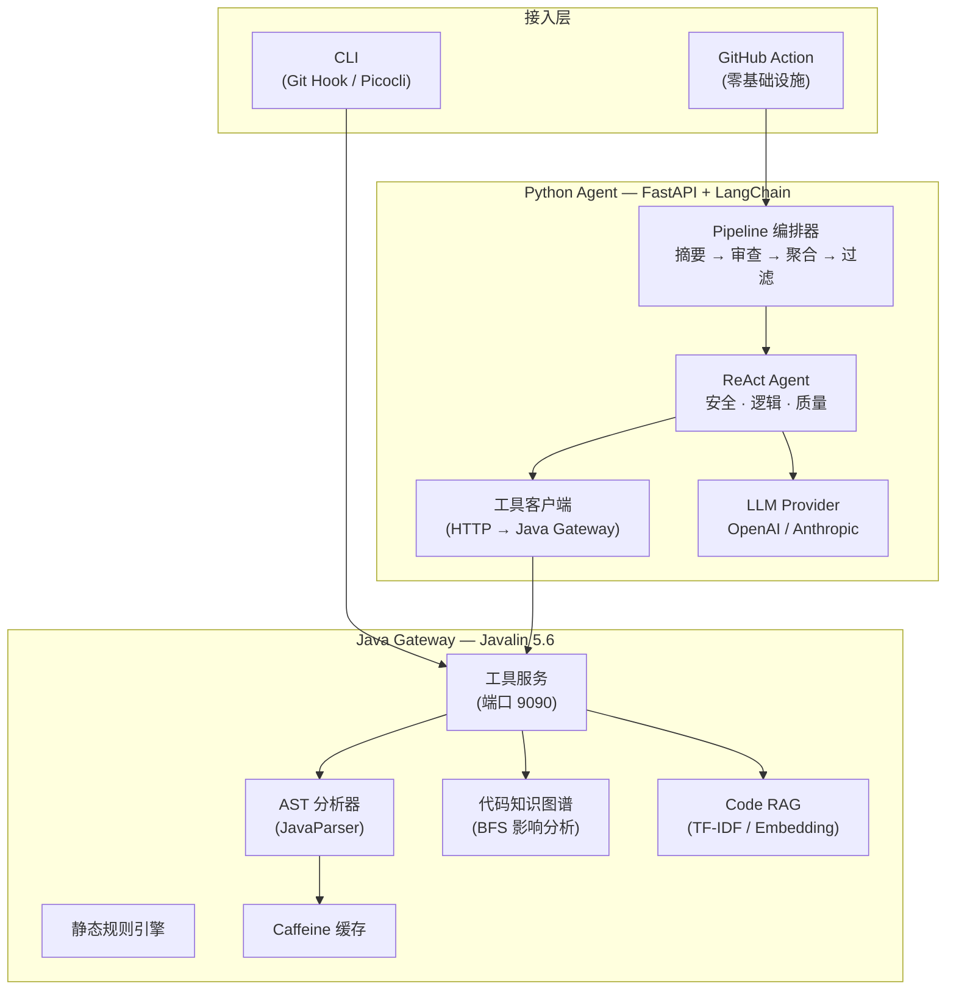

<div align="center">

# DiffGuard

**AI 驱动的分层智能代码审查系统**

[](https://adoptium.net/)
[](https://www.python.org/)
[](https://langchain.com/)
[](LICENSE)
[](CONTRIBUTING.md)

[English](README.md) | **中文**

DiffGuard 融合深度代码理解（AST 分析、代码知识图谱、语义检索）与 LLM 驱动的分层审查编排，提供生产级的上下文感知代码审查能力。

[架构设计](#架构设计) · [快速开始](#快速开始) · [核心特性](#核心特性) · [部署方案](#部署方案) · [贡献指南](#贡献指南)

</div>

---

## 为什么选择 DiffGuard

通用 LLM 代码审查缺乏项目上下文——它只看到一个 diff，却不理解背后的代码库。DiffGuard 通过 **Gateway + Agent** 架构弥合这一鸿沟：Java Gateway 提供深度代码智能工具，供 LLM Agent 在审查过程中按需调用。

| 痛点 | DiffGuard 的方案 |
|---|---|
| LLM 审查缺乏项目上下文 | AST 分析 + 代码知识图谱 + Code RAG 提供语义理解 |
| 误报率高 | 两层过滤：正则规则（零 LLM 成本）+ 可选 LLM 二次验证 |
| 每次审查 LLM 调用成本高 | 静态规则前置过滤，Diff 摘要压缩降低 Token 消耗 |
| 难以集成到现有工作流 | CLI（Git Hook）· CI（GitHub Action）双模式接入 |
| 不同 PR 需要不同审查深度 | Pipeline 模式可配置阶段；Simple 和 Multi-Agent 在路线图中 |

---

## 核心特性

### 审查模式

| 模式 | 架构 | 状态 |
|---|---|---|
| **Pipeline** | 4 阶段 Pipeline + 并行域审查器 | **当前版本** |
| **Simple** | Java Gateway 直接调用 LLM | 路线图 |
| **Multi-Agent** | 兼容入口（当前回退到 Pipeline） | 兼容保留 |

> 说明：当前 `services/agent/src` 主实现为 Pipeline；`MULTI_AGENT` 在接口层保留，并与 `PIPELINE` 共用执行链路。

### 4 阶段审查 Pipeline

```
Diff → 摘要 → 并行审查 → 聚合 → 误报过滤 → 报告
         ▲          ▲            ▲            ▲
    (LLM 摘要)  (安全/逻辑/    (去重 + 行号  (正则规则 +
                  质量)         映射)        LLM 验证)
```

**摘要阶段** — LLM 提取变更概述、风险等级（1-5），并将文件智能路由至专业审查器。

**审查阶段** — 安全 / 逻辑 / 质量三个审查器并行执行（`asyncio.gather`）。每个审查器可选以 ReAct Agent 模式运行，自主调用 6 种代码智能工具。

**聚合阶段** — 去重、排序、将 diff 上下文行号映射为实际文件行号，执行 Token 预算控制（`MAX_TOTAL_ISSUES = 50`）。

**误报过滤** — 两阶段：正则硬规则（零 LLM 成本）过滤常见噪声；可选 LLM 验证处理边界情况。

### 深度代码理解

| 能力 | 实现 | 细节 |
|---|---|---|
| **AST 分析** | JavaParser | 方法签名、调用边、控制流、字段访问、数据流——单文件级提取 |
| **代码知识图谱** | BFS 图引擎 | 节点：File/Class/Interface/Method。边：CALLS/EXTENDS/IMPLEMENTS/IMPORTS/CONTAINS。BFS 影响范围分析 |
| **Code RAG** | 多粒度代码切片 + 向量存储 | TF-IDF（零依赖）或 OpenAI Embedding。内存或 Redis 向量存储 |
| **6 种 Agent 工具** | LangChain `@tool` 调用 Java Tool Server | 文件内容、Diff 上下文、方法定义、调用图、关联文件、语义搜索 |

### 生产级工程化

| 领域 | 实现 |
|---|---|
| **安全** | 路径穿越防护（`FileAccessSandbox`）、基于 Session 的工具访问控制（UUID v4 + 10 分钟 TTL） |
| **韧性** | 当前主链：Pipeline（摘要→审查→聚合→过滤）；`--multi-agent` 兼容回退到 Pipeline。熔断器 + `CallerRunsPolicy` 背压 |
| **性能** | Caffeine AST 缓存（内容哈希键）、大 PR 自动分片（`MAX_FILES_PER_CHUNK=10`）、审查器并行执行 |
| **可观测性** | 每阶段 Token 用量追踪、结构化日志（`request_id` 链路传播）、Prometheus 指标端点 |
| **多模型** | OpenAI / Anthropic / 任意 OpenAI 兼容 Provider。YAML + 环境变量配置 |

---

## 架构设计



### 数据流

1. **CLI / GitHub Action** 触发审查请求
2. **Java Gateway** 通过 JGit 收集 diff，构建 AST 和 CodeGraph
3. **Python Agent** 接收请求（diff 条目 + Tool Server URL）
4. **摘要阶段** — LLM 总结变更并评估风险等级
5. **审查阶段** — 安全/逻辑/质量审查器并行执行，各自按需调用工具（文件内容、调用图、语义搜索）
6. **聚合阶段** — 合并、去重、映射行号
7. **误报过滤** — 正则规则 + 可选 LLM 验证
8. **结果** 通过 GitHub API 发布为 PR 审查评论

---

## 快速开始

### 环境要求

- Java 21（推荐 Eclipse Temurin）
- Maven 3.9+
- Python 3.12+（仅 Agent 服务需要）
- LLM API Key（OpenAI、Anthropic 或兼容 Provider）

### 30 秒 CLI 体验

```bash
git clone https://github.com/kunxing/diffguard.git
cd diffguard

# 构建 Java Gateway
cd services/gateway && mvn clean package -DskipTests && cd ../..

# 设置 LLM API Key
export DIFFGUARD_API_KEY="sk-your-api-key"

# 审查指定 PR
java -jar services/gateway/target/diffguard-*.jar review --pr owner/repo#123
```

### GitHub Action（零基础设施）

在 workflow YAML 中添加：

```yaml
- name: DiffGuard Code Review
  uses: kunxing/diffguard@v2
  with:
    api-key: ${{ secrets.DIFFGUARD_API_KEY }}
    provider: claude
    model: claude-sonnet-4-20250514
    language: zh
    comment-pr: true
    exclude-directories: "docs,examples"
    enable-fp-filter: true
    timeout-minutes: 10
    # 可选：启用 Java Tool Server（让 Agent 在审查时调用 AST/调用图/语义检索工具）
    use-java-tool-server: true
    tool-server-url: http://127.0.0.1:9090
```

---

## 部署方案

### CLI 模式（本地开发）

```bash
# 构建
cd services/gateway
mvn clean package

# 安装 Git Hook（commit/push 时自动审查）
java -jar target/diffguard-*.jar install

# 审查命令
java -jar target/diffguard-*.jar review --pr owner/repo#123                 # 指定 PR
java -jar target/diffguard-*.jar review --pr owner/repo#123 --pipeline       # Pipeline 模式
java -jar target/diffguard-*.jar review --pr owner/repo#123 --multi-agent    # 兼容入口（当前与 Pipeline 同链路）

# 卸载
java -jar target/diffguard-*.jar uninstall
```

> Hook 仅支持 PR 模式。请提前设置 `DIFFGUARD_PR=owner/repo#number`，未设置时 Hook 会跳过审查。

### Action-only 配套服务（Docker Compose）

```bash
export DIFFGUARD_API_KEY="sk-your-api-key"
export DIFFGUARD_TOOL_SECRET="your-tool-secret"  # 可选，开启后 Tool API 需携带 X-Tool-Secret

docker compose up -d
```

| 服务 | 地址 |
|---|---|
| 工具服务 | `http://localhost:9090` |
| Agent API | `http://localhost:8000/api/v1/health` |

---

## 配置说明

在项目根目录创建 `.diffguard.yml`：

```yaml
llm:
  provider: openai           # openai | anthropic
  model: gpt-4o              # 或: claude-sonnet-4-6
  api_key_env: DIFFGUARD_API_KEY
  temperature: 0.1
  max_tokens: 16384

rules:
  enabled: [security, bug-risk, code-style, performance]
  severity_threshold: info

review:
  max_diff_files: 20
  max_tokens_per_file: 4000
```

### 环境变量

| 变量名 | 说明 | 必需 |
|---|---|---|
| `DIFFGUARD_API_KEY` | LLM API Key | 是 |
| `DIFFGUARD_API_BASE_URL` | 自定义 API 端点（用于代理） | 否 |
| `DIFFGUARD_TOOL_SECRET` | Tool Server 认证密钥 | 可选（启用 Tool Server 认证时） |

---

## 项目结构

```
services/
├── gateway/                              # Java Gateway (Javalin 5.6)
│   └── src/main/java/com/diffguard/
│       ├── cli/                          # CLI 主入口与子命令
│       ├── toolserver/                   # Tool Server: 会话管理、REST 端点
│       ├── orchestrator/                 # Orchestrator API: 任务创建/状态/结果
│       ├── review/                       # 审查核心: 引擎、AST、规则、RAG
│       ├── agent/                        # Agent 工具体系: core/tools/python
│       ├── platform/                     # 平台能力: config/git/llm/messaging/...
│       └── pom.xml                       # Maven 构建（shade plugin fat JAR）
│
└── agent/                                # Python Agent (FastAPI + LangChain)
    ├── src/diffguard_agent/
    │   ├── main.py                       # FastAPI 入口 + Uvicorn
    │   ├── config.py                     # 配置（基于环境变量）
    │   ├── models/schemas.py             # Pydantic v2 请求/响应模型
    │   ├── metrics.py                    # 审查指标追踪
    │   ├── github/                       # GitHub API 客户端与评论构建
    │   ├── utils/                        # diff 切分工具
    │   ├── agent/
    │   │   ├── pipeline_orchestrator.py  # Pipeline 编排 + 自动分片
    │   │   ├── llm_utils.py              # 多 Provider LLM 工厂 + 重试
    │   │   ├── false_positive_filter.py  # 两阶段误报过滤（正则 + LLM）
    │   │   ├── diff_parser.py            # Diff 行号映射器
    │   │   └── pipeline/stages/
    │   │       ├── summary.py            # 阶段 1: LLM Diff 摘要
    │   │       ├── reviewer.py           # 阶段 2: 并行域审查器（ReAct）
    │   │       ├── aggregation.py        # 阶段 3: 合并、去重、行号映射
    │   │       ├── fp_filter_stage.py    # 阶段 4: 误报过滤
    │   │       └── static_rules.py       # 可选静态规则阶段
    │   ├── llm/prompts/pipeline/         # Pipeline 阶段提示词（system + user）
    │   └── tools/                        # Tool 客户端包装（当前仓库存在迁移残留）
    └── tests/                            # pytest 测试
```

---

## 工程亮点

### 六边形架构（Gateway）

Java Gateway 严格遵循六边形架构与依赖倒置原则：
- `domain/` 层**零外部依赖**（仅 JDK）
- `infrastructure/` 实现 `domain` 定义的接口
- `adapter/` 处理入站 HTTP（Tool Server）
- 所有跨层通信通过接口，从不依赖具体实现

### 代码知识图谱

基于 AST 分析结果构建的图引擎支持：
- **4 种节点类型**：FILE、CLASS、INTERFACE、METHOD
- **5 种边类型**：CALLS、EXTENDS、IMPLEMENTS、IMPORTS、CONTAINS
- **BFS 影响分析**：`computeImpactSet(changedNodes, maxDepth)` 追踪变更影响范围
- **最短路径**：`findShortestPath(from, to)` 分析依赖链路
- 线程安全的 build-then-read 模式，查询返回不可变视图

### ReAct Agent + 工具调用

每个域审查器可作为 LangChain ReAct Agent 运行：
1. LLM 接收 diff + 系统提示词
2. Agent 自主调用工具（文件内容、调用图、语义搜索）进行代码调查
3. Agent 输出结构化 JSON 结果
4. Fallback 解析器处理非 JSON 响应（正则提取 → LLM 重新解析）

### 模式兼容说明

```
`MULTI_AGENT`（兼容入口）→ `PIPELINE`（当前执行链）
```

当前 Python Agent 的稳定主链是 Pipeline；`MULTI_AGENT` 参数在接口层保留，并复用 Pipeline 执行。

### 误报过滤器

两阶段 Pipeline 实现低成本噪声过滤：
1. **正则硬规则**（零 LLM 成本）：基于可配置 YAML 规则的模式匹配排除
2. **LLM 验证**（可选）：边界情况交由 LLM 二次判断，设置置信度阈值

### 大 PR 自动分片

当 PR 触及超过 10 个文件或超过 60K 字符时，Pipeline 自动：
1. 将 diff 按文件数量和字符预算分片
2. 每个 chunk 独立运行完整 4 阶段 Pipeline（共享 Tool Session）
3. 合并并去重所有 chunk 的问题

---

## 技术栈

| 层级 | 技术 | 版本 |
|---|---|---|
| **Gateway** | Java（Javalin, Picocli, JavaParser, JGit） | 21 |
| **Agent** | Python（FastAPI, LangChain, Pydantic v2） | 3.12 |
| **AST** | JavaParser + SPI 多语言扩展 | 3.26 |
| **图谱** | 自研 BFS 图引擎 | — |
| **RAG** | TF-IDF / OpenAI Embedding + 内存/Redis 向量存储 | — |
| **缓存** | Caffeine（内容哈希键） | 3.1 |
| **HTTP** | Javalin（Gateway）、httpx async（Agent） | — |
| **构建** | Maven（shade plugin）、uv（Python） | — |
| **容器** | Docker Compose（非 root、健康检查） | — |
| **CI** | GitHub Actions（Java 21 + Python 3.12 矩阵） | — |
| **测试** | JUnit 5 + Mockito（Java）、pytest + pytest-asyncio（Python） | — |

---

## 贡献指南

```bash
# Java 开发
cd services/gateway
mvn clean verify           # 构建 + 测试 + 覆盖率

# Python 开发
cd services/agent
uv sync --dev               # 安装含开发依赖
uv run pytest tests/ -v     # 运行测试
uv run ruff check src/diffguard_agent tests/  # 代码检查
```

欢迎提交 Pull Request，请详细描述变更内容和动机。

工程规范详见 [JAVA.md](JAVA.md) 和 [PYTHON.md](PYTHON.md)。

---

## License

[MIT License](LICENSE)
