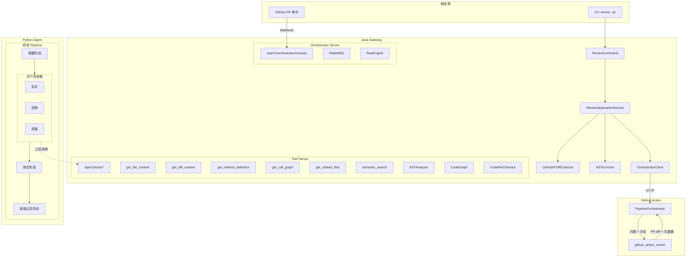
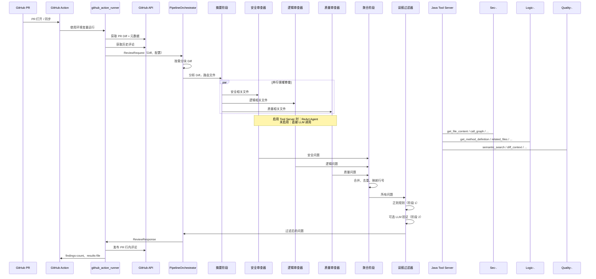

<p align="center">
  
</p>

<h1 align="center">DiffGuard</h1>

<p align="center">
  <strong>AI 驱动的多 Pipeline 代码审查 — 安全、逻辑、质量，一个 Action 搞定。</strong>
</p>

<p align="center">
  中文 | <a href="./README.md">English</a>
</p>

<p align="center">
  
  
  
  
  
</p>

---

## DiffGuard 是什么？

DiffGuard 是一个 AI 代码审查引擎，通过**多阶段 Pipeline** 对 Pull Request 进行分析，内建并行领域审查器（安全、逻辑、质量）。它可以作为 **GitHub Action** 零基础设施运行，也可以作为独立的 **CLI / Docker 服务** 进行高级部署。

与仅基于规则的 Linter 不同，DiffGuard 使用 LLM 驱动的深度分析，并支持可选的**工具调用 Agent**——可以读取源文件、遍历调用图、执行语义代码搜索——让审查者拥有与人类审查者相同的上下文。

---

## 核心特性

### 多阶段审查 Pipeline
4 阶段编排 Pipeline：**摘要 → 并行审查器 → 聚合 → 误报过滤器**。每个阶段可组合，支持通过 YAML 配置。

### 并行领域审查器
三个专项审查器并发执行：
- **安全（Security）** — 注入攻击、认证授权、数据泄露、加密、XSS、SSRF
- **逻辑（Logic）** — 空值安全、并发、资源管理、数据一致性
- **质量（Quality）** — 复杂度、错误处理、可维护性、最佳实践

### 工具调用 ReAct Agent
启用 Java Tool Server 后，审查器变为 **LangChain ReAct Agent**，拥有 6 个工具：
- `get_file_content` — 读取项目源文件
- `get_diff_context` — 查询 Diff 摘要或单文件内容
- `get_method_definition` — 通过 AST 提取方法签名
- `get_call_graph` — 遍历调用者/被调用者/影响范围
- `get_related_files` — 查找依赖和关联文件
- `semantic_search` — 向量代码搜索（TF-IDF 或 OpenAI Embeddings）

### 误报过滤器
两阶段过滤：**确定性正则规则**（零 LLM 成本）+ 可选的 **LLM 验证**。内置 28 条先例规则，覆盖 Spring、MyBatis、React、JPA 等常见框架。

### 静态规则引擎（零 LLM 成本）
预审查规则，扫描新增行：SQL 注入模式、硬编码密钥、危险函数调用、过深层嵌套。

### Token 感知 Diff 分块
大型 PR 自动拆分为多个分块，采用首次适应递减装箱算法和 Hunk 级别拆分。跨分块问题自动去重。

### 多模型支持
- **Claude** — Anthropic API 原生支持
- **OpenAI** — GPT-4o、GPT-5 及兼容端点
- **代理** — 自动检测 OpenAI 兼容代理并回退

### GitHub Action（复合 Action）
开箱即用的 GitHub Action，支持 PR 行内评论、严重级别图标和审查摘要。输出 `findings-count` 用于下游工作流门禁。

### 弹性与可观测性
- 熔断器（Resilience4j）保护 LLM 和 Agent 调用
- 速率限制（10 req/s 令牌桶）
- 指数退避重试 + 抖动
- Prometheus 指标（审查数、问题数、Token 用量、耗时）
- 审查缓存（Caffeine + 磁盘，24 小时 TTL）

---

## 系统架构



---

## 项目结构

```
DiffGuard/
├── action.yml                          # GitHub 复合 Action 定义
├── docker-compose.yml                  # 全栈：Gateway + Agent + RabbitMQ
├── services/
│   ├── gateway/                        # Java 21 Gateway（Maven）
│   │   ├── pom.xml                     # 依赖：Javalin、JavaParser、Resilience4j 等
│   │   ├── Dockerfile                  # eclipse-temurin:21-jre
│   │   ├── .env.example
│   │   └── src/main/java/com/diffguard/
│   │       ├── cli/                    # CLI 入口：review、install、uninstall、tool-server、orchestrator-server
│   │       ├── review/                 # 审查编排、缓存、引擎工厂
│   │       │   ├── ast/                # AST 分析（JavaParser）、缓存、SPI
│   │       │   ├── codegraph/          # 代码知识图谱（节点 + 边）
│   │       │   ├── coderag/            # 语义搜索（TF-IDF / OpenAI + ChromaDB）
│   │       │   ├── rules/              # 静态规则引擎（SQL 注入、密钥等）
│   │       │   └── model/              # ReviewIssue、ReviewResult、Severity、DiffFileEntry
│   │       ├── agent/tools/            # Tool Server 的工具实现
│   │       ├── orchestrator/           # Orchestrator REST API + RabbitMQ 调度
│   │       ├── toolserver/             # Tool Server HTTP 端点 + 会话管理
│   │       ├── platform/
│   │       │   ├── llm/                # LLM 客户端、Claude/OpenAI Provider、批量执行器
│   │       │   ├── config/             # 三层配置加载（项目 → 用户目录 → 内置模板）
│   │       │   ├── git/                # GitHub PR Diff 收集器 + 本地 JGit Diff
│   │       │   ├── prompt/             # Prompt 模板构建器 + 加载器
│   │       │   ├── messaging/          # RabbitMQ 拓扑 + 任务发布
│   │       │   ├── resilience/         # 熔断器、速率限制、重试（Resilience4j）
│   │       │   ├── observability/      # Micrometer + Prometheus 指标
│   │       │   └── output/             # 终端 UI、Markdown 格式化、进度展示
│   │       └── exception/              # 领域异常
│   │
│   └── agent/                          # Python 3.11+ Agent
│       ├── pyproject.toml              # FastAPI、LangChain、httpx、ChromaDB 等
│       ├── Dockerfile                  # python:3.12-slim + uv
│       ├── .env.example
│       ├── config/
│       │   └── false-positive-rules.yaml  # 14 条排除规则 + 28 条先验规则
│       ├── scripts/
│       │   └── e2e_review.ps1          # 端到端审查测试脚本
│       └── src/diffguard_agent/
│           ├── main.py                 # FastAPI 应用：/health、/review
│           ├── config.py               # 从环境变量加载配置
│           ├── github_action_runner.py # 独立 Action 入口（无需服务器）
│           ├── github_api.py           # 同步 GitHub 客户端（Action 模式）
│           ├── github/                 # 异步 GitHub 客户端 + 评论构建器
│           ├── agent/
│           │   ├── pipeline_orchestrator.py  # 分块 + 4 阶段 Pipeline
│           │   ├── diff_parser.py      # Diff → 文件行号映射
│           │   ├── llm_utils.py        # LLM 工厂、重试、错误分类
│           │   ├── false_positive_filter.py  # 两阶段误报过滤
│           │   └── pipeline/
│           │       ├── pipeline-config.yaml   # Pipeline DSL 配置
│           │       ├── pipeline_config.py     # YAML Pipeline 加载器
│           │       └── stages/
│           │           ├── summary.py         # 阶段 1：Diff 摘要 + 文件路由
│           │           ├── reviewer.py        # 阶段 2：并行领域审查器
│           │           ├── aggregation.py     # 阶段 3：合并 + 去重 + 行号映射
│           │           ├── fp_filter_stage.py # 阶段 4：误报过滤
│           │           └── static_rules.py    # 零成本正则预审查
│           ├── llm/prompts/pipeline/   # 领域专用 Prompt 模板
│           │   ├── security-system.txt, security-user.txt
│           │   ├── logic-system.txt, logic-user.txt
│           │   ├── quality-system.txt, quality-user.txt
│           │   ├── aggregation-system.txt, aggregation-user.txt
│           │   ├── diff-summary-system.txt, diff-summary-user.txt
│           │   └── react-user.txt
│           ├── models/schemas.py       # Pydantic 请求/响应模型
│           ├── tools/                  # LangChain 工具工厂 → Java Tool Server
│           ├── utils/                  # Diff 拆分工具
│           └── metrics.py             # 阶段级指标收集器
└── .github/workflows/
    ├── ci.yml                          # Java mvn verify + Python pytest
    ├── diffguard-review.yml            # 自动 PR 审查
    └── diffguard-manual-test.yml       # 手动审查触发
```

---

## 快速开始

### 方式一：GitHub Action（推荐）

在你的仓库中创建 `.github/workflows/diffguard-review.yml`：

```yaml
name: DiffGuard Review
on:
  pull_request:
    types: [opened, synchronize, reopened, ready_for_review]

jobs:
  review:
    runs-on: ubuntu-latest
    steps:
      - uses: actions/checkout@v4
      - uses: DiffGuard/diffguard@main
        with:
          api-key: ${{ secrets.DIFFGUARD_API_KEY }}
          provider: claude
          model: claude-sonnet-4-20250514
          language: zh
          comment-pr: true
          enable-fp-filter: true
```

将你的 API Key 添加为仓库 Secret（`DIFFGUARD_API_KEY`）。

### 方式二：CLI（本地）

前提条件：Java 21、Maven 3.9+

```bash
# 克隆并构建
git clone https://github.com/Eleven-Mouse/DiffGuard.git
cd DiffGuard/services/gateway
mvn -DskipTests package

# 运行审查
export GITHUB_TOKEN=ghp_your_token
export DIFFGUARD_API_KEY=sk-ant-your-key
java -jar target/diffguard-1.0.0.jar review --pr owner/repo#123 --pipeline
```

### 方式三：Docker Compose

```bash
git clone https://github.com/Eleven-Mouse/DiffGuard.git
cd DiffGuard

# 配置
cp services/gateway/.env.example services/gateway/.env
# 编辑 .env 填入你的 API Key

# 启动所有服务
docker compose up -d
```

启动的服务：
- **RabbitMQ** — 端口 5672/15672
- **Gateway**（Tool Server 端口 9090，Metrics 端口 9091）
- **Agent** — 端口 8000

---

## 配置说明

### GitHub Action 输入参数

| 参数 | 默认值 | 说明 |
|---|---|---|
| `api-key` | *（必填）* | LLM API Key（Anthropic 或 OpenAI） |
| `provider` | `claude` | LLM 提供商：`claude` 或 `openai` |
| `model` | `claude-sonnet-4-20250514` | 模型名称 |
| `api-base-url` | *（空）* | 自定义 API 端点（代理） |
| `language` | `zh` | 输出语言：`zh` 或 `en` |
| `comment-pr` | `true` | 是否在 PR 上发布行内评论 |
| `exclude-directories` | *（空）* | 逗号分隔的排除目录 |
| `enable-fp-filter` | `true` | 启用误报过滤 |
| `timeout-minutes` | `10` | 审查超时时间 |
| `use-java-tool-server` | `false` | 启用工具调用 Agent |
| `tool-server-url` | `http://127.0.0.1:9090` | Tool Server 地址 |

### 环境变量

#### Java Gateway

| 变量 | 说明 |
|---|---|
| `DIFFGUARD_API_KEY` | LLM API Key |
| `DIFFGUARD_API_BASE_URL` | 自定义 LLM API 地址 |
| `DIFFGUARD_AGENT_URL` | Python Agent 服务地址 |
| `DIFFGUARD_TOOL_SERVER_URL` | Tool Server 地址（覆盖 host+port） |
| `DIFFGUARD_TOOL_SERVER_HOST` | Tool Server 主机（默认 `0.0.0.0`） |
| `DIFFGUARD_TOOL_SERVER_PORT` | Tool Server 端口（默认 `9090`） |
| `DIFFGUARD_TOOL_SECRET` | Tool Server 共享密钥 |
| `DIFFGUARD_ORCHESTRATOR_URL` | Orchestrator Server 地址 |
| `GITHUB_TOKEN` / `GH_TOKEN` / `DIFFGUARD_GITHUB_TOKEN` | GitHub API Token（任选其一） |
| `RABBITMQ_HOST` / `PORT` / `USER` / `PASSWORD` | RabbitMQ 连接配置 |

#### Python Agent

| 变量 | 说明 |
|---|---|
| `DIFFGUARD_PROVIDER` | `claude` 或 `openai` |
| `DIFFGUARD_MODEL` | 模型名称 |
| `DIFFGUARD_API_KEY` | LLM API Key |
| `DIFFGUARD_API_BASE_URL` | 自定义 API 端点 |
| `DIFFGUARD_LANGUAGE` | `zh` 或 `en` |
| `DIFFGUARD_COMMENT_PR` | `true` / `false` |
| `DIFFGUARD_ENABLE_FP_FILTER` | 启用误报过滤 |
| `DIFFGUARD_TIMEOUT_MINUTES` | 审查超时时间 |
| `DIFFGUARD_USE_JAVA_TOOL_SERVER` | 启用工具调用 |
| `DIFFGUARD_TOOL_SERVER_URL` | Tool Server 地址 |
| `DIFFGUARD_EXCLUDE_DIRS` | 逗号分隔的排除目录 |
| `GITHUB_TOKEN` | GitHub API Token |
| `GITHUB_REPOSITORY` | `owner/repo` 格式 |
| `PR_NUMBER` | 待审查的 PR 编号 |

---

## 审查流程



---

## 部署

### Docker Compose（生产环境）

```bash
docker compose up -d
```

`docker-compose.yml` 提供：
- **RabbitMQ** — Gateway 与 Agent 之间的异步任务调度
- **diffguard-gateway** — Tool Server（9090，仅绑定 localhost）+ Metrics（9091）
- **diffguard-agent** — FastAPI 审查服务（8000）
- 共享 `diffguard-net` 桥接网络
- 所有服务均配置健康检查
- RabbitMQ 数据持久化命名卷

### 独立服务

```bash
# 仅启动 Tool Server
java -jar diffguard-1.0.0.jar tool-server --port 9090

# 仅启动 Orchestrator Server
java -jar diffguard-1.0.0.jar orchestrator-server --port 8088

# 启动 Python Agent API
cd services/agent
python -m diffguard_agent.main
```

---

## 开发

### 构建与测试（Java）

```bash
cd services/gateway
mvn verify          # 构建 + 测试
mvn test            # 仅测试
mvn -DskipTests package  # 跳过测试
```

### 构建与测试（Python）

```bash
cd services/agent
uv sync --dev       # 安装含开发依赖
pytest              # 运行测试
ruff check .        # 代码检查（可选）
```

### CI

项目在每次推送到 `main` 或 PR 时运行 CI：
- **Java**：`mvn -B verify`，上传 Surefire 报告
- **Python**：`uv sync --dev` → `ruff check` → `pytest`

---

## 技术栈

| 层 | 技术 |
|---|---|
| **Gateway** | Java 21、Maven、Javalin（HTTP）、picocli（CLI） |
| **Agent** | Python 3.11+、FastAPI、LangChain、Pydantic、httpx |
| **LLM** | Claude（Anthropic API）、OpenAI（Chat Completions） |
| **AST** | JavaParser（Java 源码分析） |
| **代码图谱** | 自研图引擎（节点：FILE/CLASS/METHOD，边：CALLS/IMPLEMENTS/EXTENDS） |
| **代码 RAG** | TF-IDF / OpenAI Embeddings + ChromaDB |
| **缓存** | Caffeine（内存）+ 磁盘持久化 |
| **消息队列** | RabbitMQ（异步任务调度） |
| **弹性** | Resilience4j（熔断器、速率限制、重试） |
| **可观测性** | Micrometer + Prometheus |
| **容器** | Docker、Docker Compose |
| **CI/CD** | GitHub Actions |

---

## 路线图

基于项目 [PROGRESS.md](./PROGRESS.md)：

- [x] Tool Service 抽取（独立 Tool Server）
- [x] 4 阶段 Pipeline 审查编排器
- [x] 误报过滤器（正则 + LLM 验证）
- [x] GitHub Action 复合 Action
- [x] RabbitMQ 任务调度
- [x] ChromaDB 向量存储用于 Code RAG
- [x] AST 分析 + 代码图谱
- [ ] Orchestrator Service 完整 MQ 集成测试
- [ ] RAG 适配器 PoC（外部 Embedding 提供商）
- [ ] Rule/Result Service 抽取

---

## 参与贡献

欢迎贡献！请随时提交 Pull Request。

1. Fork 本仓库
2. 创建功能分支（`git checkout -b feature/amazing-feature`）
3. 提交你的修改
4. 推送到分支（`git push origin feature/amazing-feature`）
5. 发起 Pull Request

提交前请确保测试通过（Java：`mvn verify`，Python：`pytest`）。

---

## 许可证

本项目基于 MIT 许可证开源 — 详见 [LICENSE](./LICENSE) 文件。
