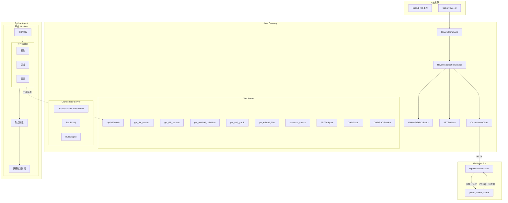
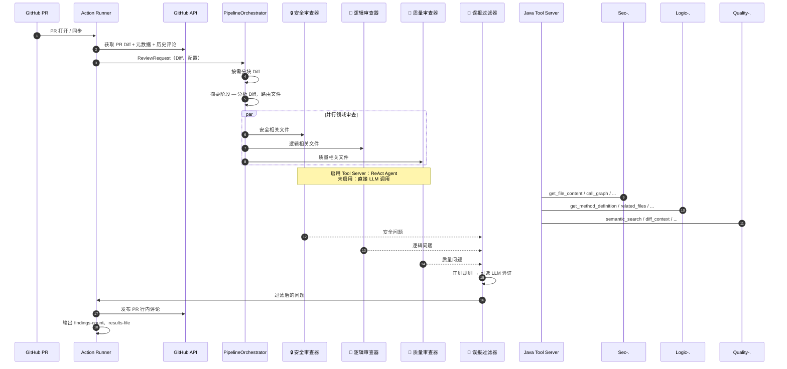

<div align="center">


<!-- typewriter tagline -->
<a href="https://github.com/Eleven-Mouse/Diffguard">
  
</a>

[English](./README.md) | 中文

**4 阶段流水线 · 3 位并行领域审查员 · 6 个工具调用 · 28 条误报规则 · 0 基础设施**

[🚀 快速开始](#-快速开始) · [✨ 核心特性](#-核心特性) · [🏛 系统架构](#-系统架构) · [⚙️ 配置说明](#️-配置说明) · [🚢 部署](#-部署) · [🧰 开发](#-开发) · [🧑‍💻 参与贡献](#-参与贡献)

</div>

---

## 🤔 为什么选择 DiffGuard？

| | 传统 Linter | 通用 LLM 机器人 | **DiffGuard** |
|---|:---:|:---:|:---:|
| 理解*你的*代码库上下文 | ❌ | ⚠️ 浅层 | ✅ **AST + 调用图 + RAG** |
| 并行领域专项审查器 | ❌ | ❌ | ✅ **安全 / 逻辑 / 质量** |
| 误报过滤 | ❌ 噪音大 | ❌ 噪音大 | ✅ **正则 + LLM 两阶段** |
| 零成本静态预扫描 | ✅ | ❌ | ✅ **密钥 / SQL 注入 / `eval` 正则** |
| 扛得住超大 PR | ✅ | ❌ Token 爆炸 | ✅ **Token 感知 FFD 分块** |
| 生产级弹性 | 不适用 | ❌ | ✅ **熔断 + 重试 + 限流** |

> 与仅基于规则的 Linter 不同，DiffGuard 使用 LLM 驱动的深度分析，并支持可选的**工具调用 ReAct Agent**——可以读取源文件、遍历调用图、执行语义代码搜索——让审查者拥有与人类审查者相同的上下文。

---

## ✨ 核心特性

<div align="center">

| 🛡️ **安全** | 🧠 **逻辑** | 🧹 **质量** |
|:---:|:---:|:---:|
| 注入攻击 · 认证授权 · 数据泄露 | 空值安全 · 并发 | 复杂度 · 错误处理 |
| 加密 · XSS · SSRF | 资源管理 · 数据一致性 | 可维护性 · 最佳实践 |

</div>

### 🔀 多阶段审查 Pipeline
4 阶段编排 Pipeline——**摘要 → 并行审查器 → 聚合 → 误报过滤器**——完全可组合，通过 YAML DSL 配置。

### 🤖 工具调用 ReAct Agent
启用 Java Tool Server 后，审查器变为 **LangChain ReAct Agent**，拥有 6 个上下文工具：

| 工具 | 为审查器提供的能力 |
|---|---|
| `get_file_content` | 读取任意项目源文件 |
| `get_diff_context` | 查询 Diff 摘要或单文件内容 |
| `get_method_definition` | 通过 AST 提取方法签名 |
| `get_call_graph` | 遍历调用者 / 被调用者 / 影响范围 |
| `get_related_files` | 查找依赖和关联文件 |
| `semantic_search` | 向量代码搜索（TF-IDF 或 OpenAI Embeddings） |

### 🧯 误报过滤器
两阶段过滤：**确定性正则规则**（零 LLM 成本）→ 可选的 **LLM 验证**。内置 **28 条先例规则**，覆盖 Spring、MyBatis、React、JPA 等常见框架。

### 📡 静态规则引擎（零 LLM 成本）
预审查规则扫描新增行：SQL 注入模式、硬编码密钥（AWS Key、GitHub Token）、危险函数调用（`Runtime.exec`、`eval`）、过深层嵌套。

### ✂️ Token 感知 Diff 分块
大型 PR 自动拆分为多个分块，采用**首次适应递减装箱算法**和 Hunk 级别拆分（每块最多 10 个文件 / 60K 字符 / 12K Token）。跨分块问题自动去重。

### 🌐 多模型支持
**Claude**（Anthropic API 原生支持）· **OpenAI**（GPT-4o、GPT-5 及兼容端点）· **代理**自动检测与回退。

### 🛟 弹性与可观测性
- ⚡ 熔断器（Resilience4j）保护 LLM 和 Agent 调用 — 50% 失败率阈值，30s 开启状态
- 🚦 速率限制 — 10 req/s 令牌桶
- 🔁 指数退避重试 + 抖动（最多 3 次）
- 📈 Prometheus 指标 — 审查数、问题数、Token 用量、耗时、静态规则命中
- 💾 审查缓存 — Caffeine + 磁盘，24 小时 TTL

### 🎣 GitHub Action（复合 Action）
开箱即用，支持 PR 行内评论、严重级别图标和审查摘要。输出 `findings-count` 用于下游工作流门禁。

---

## 🏛 系统架构


```mermaid
graph TB
    subgraph Trigger["⚡ 触发源"]
        PR["GitHub PR 事件"]
        CLI["CLI review --pr"]
    end

    subgraph GitHubAction["GitHub Action"]
        AR["github_action_runner"]
        AR -->|"PR diff + 元数据"| PO
    end

    subgraph Gateway["Java Gateway"]
        RC["ReviewCommand"]
        RAS["ReviewApplicationService"]
        GDC["GitHubPrDiffCollector"]
        AE["ASTEnricher"]
        OCS["OrchestratorClient"]

        RC --> RAS
        RAS --> GDC
        RAS --> AE
        RAS --> OCS

        subgraph ToolServer["Tool Server"]
            TS["/api/v1/tools/*"]
            FC["get_file_content"]
            DC["get_diff_context"]
            MD["get_method_definition"]
            CG["get_call_graph"]
            RF["get_related_files"]
            SS["semantic_search"]
            AST["ASTAnalyzer"]
            KG["CodeGraph"]
            RAG["CodeRAGService"]
        end

        subgraph Orchestrator["Orchestrator Server"]
            OS["/api/v1/orchestrator/reviews"]
            MQ["RabbitMQ"]
            RE["RuleEngine"]
        end
    end

    subgraph Agent["Python Agent"]
        PO["PipelineOrchestrator"]

        subgraph Pipeline["审查 Pipeline"]
            S["摘要阶段"]
            subgraph Reviewers["并行审查器"]
                SEC["安全"]
                LOG["逻辑"]
                QAL["质量"]
            end
            AGG["聚合阶段"]
            FPF["误报过滤阶段"]
        end

        S --> Reviewers --> AGG --> FPF
    end

    CLI --> RC
    OCS -->|"HTTP"| PO
    Reviewers -.->|"工具调用"| TS
    PO -->|"问题 + 评论"| AR
```

### 🔄 审查流程


```mermaid
sequenceDiagram
    autonumber
    participant PR as GitHub PR
    participant Runner as Action Runner
    participant GH as GitHub API
    participant Pipeline as PipelineOrchestrator
    participant Sec as 🔒 安全审查器
    participant Logic as 🧠 逻辑审查器
    participant Quality as 🧹 质量审查器
    participant FP as 🧯 误报过滤器
    participant ToolSrv as Java Tool Server

    PR->>Runner: PR 打开 / 同步
    Runner->>GH: 获取 PR Diff + 元数据 + 历史评论
    Runner->>Pipeline: ReviewRequest（Diff、配置）

    Pipeline->>Pipeline: 按需分块 Diff
    Pipeline->>Pipeline: 摘要阶段 — 分析 Diff，路由文件

    par 并行领域审查
        Pipeline->>Sec: 安全相关文件
        Pipeline->>Logic: 逻辑相关文件
        Pipeline->>Quality: 质量相关文件
    end

    Note over Sec,Quality: 启用 Tool Server：ReAct Agent<br/>未启用：直接 LLM 调用

    Sec-.->ToolSrv: get_file_content / call_graph / ...
    Logic-.->ToolSrv: get_method_definition / related_files / ...
    Quality-.->ToolSrv: semantic_search / diff_context / ...

    Sec-->>FP: 安全问题
    Logic-->>FP: 逻辑问题
    Quality-->>FP: 质量问题

    FP->>FP: 正则规则 → 可选 LLM 验证
    FP->>Runner: 过滤后的问题
    Runner->>GH: 发布 PR 行内评论
    Runner->>Runner: 输出 findings-count、results-file
```

---

## 🚀 快速开始

### 🥇 方式一 — GitHub Action（推荐）

在你的仓库中创建 `.github/workflows/diffguard-review.yml`：

```yaml
name: DiffGuard Review
on:
  pull_request:
    types: [opened, synchronize, reopened, ready_for_review]

permissions:
  contents: read
  pull-requests: write

jobs:
  review:
    runs-on: ubuntu-latest
    steps:
      - uses: actions/checkout@v4
      - uses: Eleven-Mouse/Diffguard@v1.0.0
        with:
          api-key: ${{ secrets.DIFFGUARD_API_KEY }}
          provider: claude
          model: claude-sonnet-4-20250514
          language: zh
          comment-pr: true
          enable-fp-filter: true
```

将你的 API Key 添加为仓库 Secret（`DIFFGUARD_API_KEY`）。完成——从此每个 PR 都会自动审查。🎉

### 🥈 方式二 — CLI（本地）

前提条件：Java 21、Maven 3.9+

```bash
# 克隆并构建
git clone https://github.com/Eleven-Mouse/DiffGuard.git
cd DiffGuard/services/gateway
mvn -DskipTests package

# 运行审查
export GITHUB_TOKEN=ghp_your_token
export DIFFGUARD_API_KEY=sk-ant-your-key
java -jar target/diffguard-1.0.0.jar review --pr owner/repo#123 --pipeline

# 启用 Java Tool Server（深度 AST / 代码图谱分析）
java -jar target/diffguard-1.0.0.jar review --pr owner/repo#123 --pipeline --force

# 安装 / 卸载 Git Hook（pre-commit + pre-push 自动审查）
java -jar target/diffguard-1.0.0.jar install
java -jar target/diffguard-1.0.0.jar uninstall

# 独立服务
java -jar target/diffguard-1.0.0.jar tool-server --port 9090
java -jar target/diffguard-1.0.0.jar orchestrator-server --port 8088
```

> 💡 Git Hook 仅支持 PR 模式。请提前设置 `DIFFGUARD_PR=owner/repo#number`，未设置时 Hook 会跳过审查。

### 🥉 方式三 — Docker Compose

```bash
git clone https://github.com/Eleven-Mouse/DiffGuard.git
cd DiffGuard

# 配置
cp services/gateway/.env.example services/gateway/.env
# 编辑 .env 填入你的 API Key

# 启动全栈
docker compose up -d
```

启动的服务：

| 服务 | 端口 | 角色 |
|---|---|---|
| 🐰 RabbitMQ | 5672 / 15672 | 异步任务调度 |
| ☕ Gateway | 9090（Tool Server）· 9091（Metrics） | AST · 代码图谱 · RAG |
| 🐍 Agent | 8000 | FastAPI 审查流水线 |

---

## ⚙️ 配置说明

<details open>
<summary><b>📋 GitHub Action 输入参数</b></summary>

| 参数 | 默认值 | 说明 |
|---|---|---|
| `api-key` | *（必填）* | LLM API Key（Anthropic 或 OpenAI） |
| `provider` | `claude` | LLM 提供商：`claude` 或 `openai` |
| `model` | `claude-sonnet-4-20250514` | 模型名称 |
| `api-base-url` | *（空）* | 自定义 API 端点（代理） |
| `language` | `zh` | 输出语言：`zh` 或 `en` |
| `comment-pr` | `true` | 是否在 PR 上发布行内评论 |
| `exclude-directories` | *（空）* | 逗号分隔的排除目录 |
| `enable-fp-filter` | `true` | 启用误报过滤 |
| `timeout-minutes` | `10` | 审查超时时间 |
| `use-java-tool-server` | `false` | 启用工具调用 Agent |
| `tool-server-url` | `http://127.0.0.1:9090` | Tool Server 地址 |

</details>

<details>
<summary><b>☕ Java Gateway 环境变量</b></summary>

| 变量 | 说明 |
|---|---|
| `DIFFGUARD_API_KEY` | LLM API Key |
| `DIFFGUARD_API_BASE_URL` | 自定义 LLM API 地址 |
| `DIFFGUARD_AGENT_URL` | Python Agent 服务地址 |
| `DIFFGUARD_TOOL_SERVER_URL` | Tool Server 地址（覆盖 host+port） |
| `DIFFGUARD_TOOL_SERVER_HOST` | Tool Server 主机（默认 `localhost`） |
| `DIFFGUARD_TOOL_SERVER_PORT` | Tool Server 端口（默认 `9090`） |
| `DIFFGUARD_TOOL_SECRET` | Tool Server 共享密钥 |
| `DIFFGUARD_ORCHESTRATOR_URL` | Orchestrator Server 地址 |
| `GITHUB_TOKEN` / `GH_TOKEN` / `DIFFGUARD_GITHUB_TOKEN` | GitHub API Token（任选其一） |
| `RABBITMQ_HOST` / `PORT` / `USER` / `PASSWORD` | RabbitMQ 连接配置 |

</details>

<details>
<summary><b>🐍 Python Agent 环境变量</b></summary>

| 变量 | 说明 |
|---|---|
| `DIFFGUARD_PROVIDER` | `claude` 或 `openai` |
| `DIFFGUARD_MODEL` | 模型名称 |
| `DIFFGUARD_API_KEY` | LLM API Key |
| `DIFFGUARD_API_BASE_URL` | 自定义 API 端点 |
| `DIFFGUARD_LANGUAGE` | `zh` 或 `en` |
| `DIFFGUARD_COMMENT_PR` | `true` / `false` |
| `DIFFGUARD_ENABLE_FP_FILTER` | 启用误报过滤 |
| `DIFFGUARD_TIMEOUT_MINUTES` | 审查超时时间 |
| `DIFFGUARD_USE_JAVA_TOOL_SERVER` | 启用工具调用 |
| `DIFFGUARD_TOOL_SERVER_URL` | Tool Server 地址 |
| `DIFFGUARD_EXCLUDE_DIRS` | 逗号分隔的排除目录 |
| `GITHUB_TOKEN` | GitHub API Token |
| `GITHUB_REPOSITORY` | `owner/repo` 格式 |
| `PR_NUMBER` | 待审查的 PR 编号 |

</details>

---

## 🗂 项目结构

<details>
<summary><b>展开完整目录树</b></summary>

```
DiffGuard/
├── action.yml                          # GitHub 复合 Action 定义
├── docker-compose.yml                  # 全栈：Gateway + Agent + RabbitMQ
├── services/
│   ├── gateway/                        # Java 21 Gateway（Maven）
│   │   ├── pom.xml                     # 依赖：Javalin、JavaParser、Resilience4j 等
│   │   ├── Dockerfile                  # eclipse-temurin:21-jre
│   │   ├── .env.example
│   │   └── src/main/java/com/diffguard/
│   │       ├── cli/                    # CLI 入口：review、install、uninstall、tool-server、orchestrator-server
│   │       ├── review/                 # 审查编排、缓存、引擎工厂
│   │       │   ├── ast/                # AST 分析（JavaParser）、缓存、SPI
│   │       │   ├── codegraph/          # 代码知识图谱（节点 + 边）
│   │       │   ├── coderag/            # 语义搜索（TF-IDF / OpenAI + ChromaDB）
│   │       │   ├── rules/              # 静态规则引擎（SQL 注入、密钥等）
│   │       │   └── model/              # ReviewIssue、ReviewResult、Severity、DiffFileEntry
│   │       ├── agent/tools/            # Tool Server 的工具实现
│   │       ├── orchestrator/           # Orchestrator REST API + RabbitMQ 调度
│   │       ├── toolserver/             # Tool Server HTTP 端点 + 会话管理
│   │       ├── platform/
│   │       │   ├── llm/                # LLM 客户端、Claude/OpenAI Provider、批量执行器
│   │       │   ├── config/             # 三层配置加载（项目 → 用户目录 → 内置模板）
│   │       │   ├── git/                # GitHub PR Diff 收集器 + 本地 JGit Diff
│   │       │   ├── prompt/             # Prompt 模板构建器 + 加载器
│   │       │   ├── messaging/          # RabbitMQ 拓扑 + 任务发布
│   │       │   ├── resilience/         # 熔断器、速率限制、重试（Resilience4j）
│   │       │   ├── observability/      # Micrometer + Prometheus 指标
│   │       │   └── output/             # 终端 UI、Markdown 格式化、进度展示
│   │       └── exception/              # 领域异常
│   │
│   └── agent/                          # Python 3.12 Agent
│       ├── pyproject.toml              # FastAPI、LangChain、httpx、ChromaDB 等
│       ├── Dockerfile                  # python:3.12-slim + uv
│       ├── .env.example
│       ├── config/
│       │   └── false-positive-rules.yaml  # 14 条排除规则 + 28 条先验规则
│       ├── scripts/
│       │   └── e2e_review.ps1          # 端到端审查测试脚本
│       └── src/diffguard_agent/
│           ├── main.py                 # FastAPI 应用：/health、/review
│           ├── config.py               # 从环境变量加载配置
│           ├── github_action_runner.py # 独立 Action 入口（无需服务器）
│           ├── github_api.py           # 同步 GitHub 客户端（Action 模式）
│           ├── github/                 # 异步 GitHub 客户端 + 评论构建器
│           ├── agent/
│           │   ├── pipeline_orchestrator.py  # 分块 + 4 阶段 Pipeline
│           │   ├── diff_parser.py      # Diff → 文件行号映射
│           │   ├── llm_utils.py        # LLM 工厂、重试、错误分类
│           │   ├── false_positive_filter.py  # 两阶段误报过滤
│           │   └── pipeline/
│           │       ├── pipeline-config.yaml   # Pipeline DSL 配置
│           │       ├── pipeline_config.py     # YAML Pipeline 加载器
│           │       └── stages/
│           │           ├── summary.py         # 阶段 1：Diff 摘要 + 文件路由
│           │           ├── reviewer.py        # 阶段 2：并行领域审查器
│           │           ├── aggregation.py     # 阶段 3：合并 + 去重 + 行号映射
│           │           ├── fp_filter_stage.py # 阶段 4：误报过滤
│           │           └── static_rules.py    # 零成本正则预审查
│           ├── llm/prompts/pipeline/   # 领域专用 Prompt 模板
│           ├── models/schemas.py       # Pydantic 请求/响应模型
│           ├── tools/                  # LangChain 工具工厂 → Java Tool Server
│           ├── utils/                  # Diff 拆分工具
│           └── metrics.py             # 阶段级指标收集器
└── .github/workflows/
    ├── ci.yml                          # 手动 CI：Java mvn verify + Python pytest
    ├── diffguard-review.yml            # 自动 PR 审查
    ├── diffguard-manual-test.yml       # 手动审查触发
    └── release.yml                     # 基于标签的发布流水线
```

</details>

---

## 🚢 部署

<details open>
<summary><b>🐳 Docker Compose（生产环境）</b></summary>

```bash
docker compose up -d
```

`docker-compose.yml` 提供：
- **RabbitMQ** — Gateway 与 Agent 之间的异步任务调度
- **diffguard-gateway** — Tool Server（9090，仅绑定 localhost）+ Metrics（9091）
- **diffguard-agent** — FastAPI 审查服务（8000）
- 共享 `diffguard-net` 桥接网络
- 所有服务均配置健康检查
- RabbitMQ 数据持久化命名卷

</details>

<details>
<summary><b>📦 独立服务</b></summary>

```bash
# 仅启动 Tool Server
java -jar diffguard-1.0.0.jar tool-server --port 9090

# 仅启动 Orchestrator Server
java -jar diffguard-1.0.0.jar orchestrator-server --port 8088

# 启动 Python Agent API
cd services/agent
python -m diffguard_agent.main
```

</details>

---

## 🛠 技术栈

<div align="center">

| 🧱 层 | ⚙️ 技术 |
|---|---|
| **Gateway** | Java 21 · Maven · Javalin（HTTP）· picocli（CLI） |
| **Agent** | Python 3.12 · FastAPI · LangChain · Pydantic · httpx |
| **LLM** | Claude（Anthropic API）· OpenAI（Chat Completions） |
| **AST** | JavaParser（Java 源码分析） |
| **代码图谱** | 自研图引擎（节点：FILE/CLASS/METHOD，边：CALLS/IMPLEMENTS/EXTENDS） |
| **代码 RAG** | TF-IDF / OpenAI Embeddings + ChromaDB |
| **缓存** | Caffeine（内存）+ 磁盘持久化 |
| **消息队列** | RabbitMQ（异步任务调度） |
| **弹性** | Resilience4j（熔断器、速率限制、重试） |
| **可观测性** | Micrometer + Prometheus |
| **容器** | Docker · Docker Compose |
| **CI/CD** | GitHub Actions |

</div>

---

## 🧑‍💻 参与贡献

欢迎贡献！🎉

1. 🍴 Fork 本仓库
2. 🌿 创建功能分支（`git checkout -b feature/amazing-feature`）
3. ✅ 提交你的修改
4. ⬆️ 推送到分支（`git push origin feature/amazing-feature`）
5. 🔃 发起 Pull Request

> 提交前请确保测试通过 — Java：`mvn verify`，Python：`pytest`。

---

## 📄 许可证

本项目基于 MIT 许可证开源 — 详见 [LICENSE](./LICENSE) 文件。

---

<div align="center">


</div>
