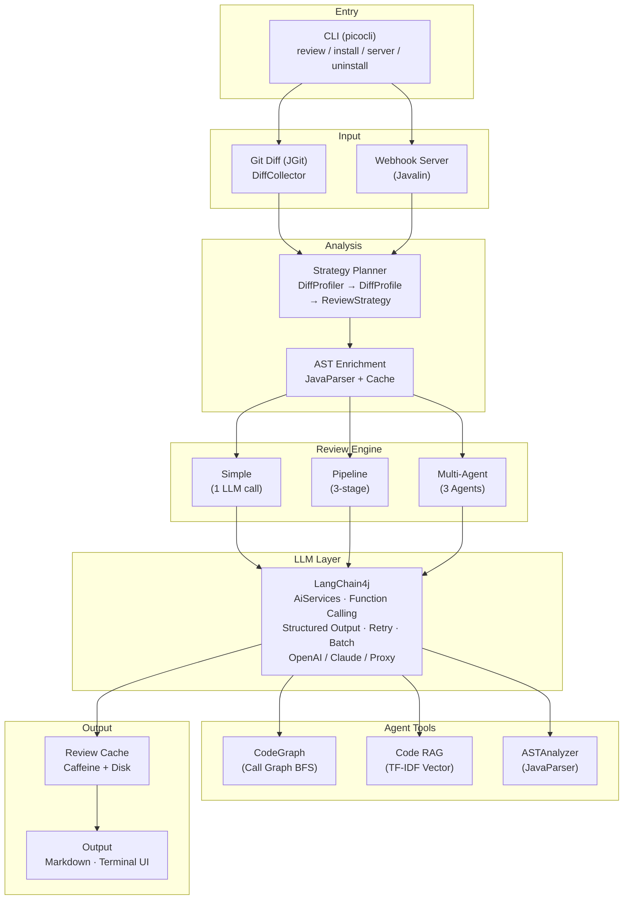
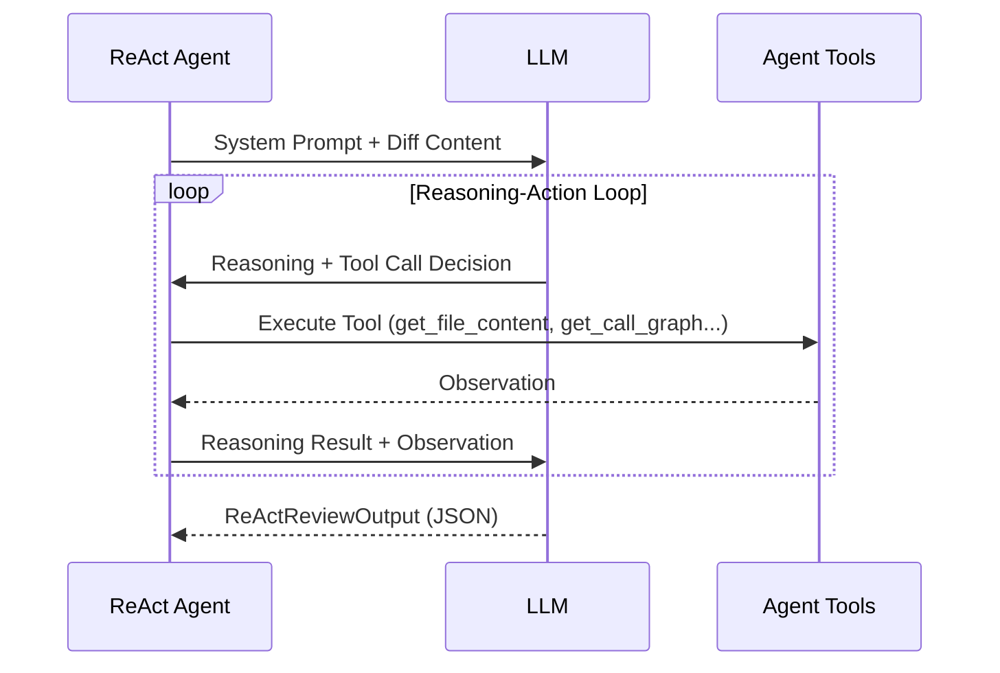

<div align="center">

# DiffGuard

**AI-Powered Code Review Agent — Guard Your Repository at Commit Time**

[](LICENSE)
[](https://openjdk.org/)
[](https://github.com/kunxing/diffguard/actions)
[](https://github.com/langchain4j/langchain4j)

English | [中文](README.md)

</div>

---

## Introduction

DiffGuard is an LLM-powered code review agent. It integrates with Git hooks (`pre-commit` / `pre-push`) to automatically intercept code changes, perform multi-dimensional AI review, and block commits when critical issues are found. It also supports a GitHub Webhook mode that automatically posts review comments on Pull Requests.

Code review is critical for software quality, but manual reviews are limited by time, focus, and experience. DiffGuard aims to be the first line of automated defense — catching security vulnerabilities, logic errors, and performance issues at commit time, so reviewers can focus on architecture and business logic.

Unlike simple "diff + prompt" tools, DiffGuard builds a complete code understanding pipeline: JavaParser-based AST analysis, method-level call graphs, TF-IDF semantic retrieval (Code RAG), and a ReAct Agent architecture with Tool Calling. Multiple specialized agents (Security / Performance / Architecture) work in parallel with adaptive strategy planning.

## Features

| Feature | Description |
|---------|-------------|
| **Git Hook Integration** | Auto-trigger review at `pre-commit` / `pre-push` stage; block commits on CRITICAL issues |
| **GitHub Webhook** | Listen for PR events, auto-review code and post GFM comments with signature verification and rate limiting |
| **ReAct Agent** | Reasoning-Action loop powered by LangChain4j Function Calling; agents autonomously invoke tools for context |
| **Multi-Agent Parallel Review** | Security / Performance / Architecture agents run in parallel with strategy-driven weight allocation |
| **3-Stage Pipeline** | Diff Summary → Parallel specialized review (Security / Logic / Quality) → Aggregation and deduplication |
| **AST Analysis** | Real JavaParser-based AST analysis extracting method signatures, call edges, control flow, field access, and data flow |
| **Method-Level Call Graph** | Cross-file call graph (CodeGraph) with CALLS / EXTENDS / IMPLEMENTS / IMPORTS / CONTAINS edge types |
| **Code RAG** | Self-implemented TF-IDF vector retrieval with code-aware tokenization (camelCase / snake_case) and multi-granularity slicing |
| **Strategy Planning** | Diff Profiling via static analysis to identify change types (Controller / DAO / Service / Config) and dynamically adjust review focus |
| **6 Agent Tools** | GetFileContent / GetDiffContext / GetMethodDefinition / GetCallGraph / GetRelatedFiles / SemanticSearch with file access sandbox |
| **Dual LLM Support** | OpenAI and Anthropic Claude with proxy API support |
| **Two-Layer Cache** | Caffeine in-memory + disk persistence, SHA-256 keys, 24h TTL, Gzip compression |
| **Robustness** | Two-phase LLM fallback, exponential backoff retry, proxy error detection, JSON format repair |
| **Custom Prompts** | Project-level template override with 3-tier config priority (project → user → default) |

## Architecture



## Three Review Modes

### Simple Mode

Single LLM call for quick review.

```
Git Diff → Prompt Build → LLM Call → JSON Parse → ReviewResult
```

### Pipeline Mode (`--pipeline`)

Stage 1 generates a diff summary, Stage 2 runs three specialized reviewers in parallel (sharing summary context), Stage 3 aggregates and deduplicates.

```
                        ┌─ SecurityReviewer ─┐
Git Diff → DiffSummary ─┼─ LogicReviewer     ─┼→ AggregationAgent → ReviewResult
                        └─ QualityReviewer  ─┘
                              Parallel
```

### Multi-Agent Mode (`--multi-agent`)

Strategy Planner analyzes change characteristics, dynamically adjusting each agent's weight and focus. Each agent is an independent ReAct loop that can invoke 6 code analysis tools.

```
                         ┌─ SecurityAgent (ReAct + Tools) ─┐
DiffProfile → Strategy ──┼─ PerformanceAgent (ReAct + Tools) ─┼→ Aggregate → ReviewResult
                         └─ ArchitectureAgent (ReAct + Tools) ─┘
                                      Parallel
```

### ReAct Agent Loop



Available tools:

| Tool | Description |
|------|-------------|
| `get_file_content` | Read project source files (sandboxed) |
| `get_diff_context` | Get diff summary or specific file diff content |
| `get_method_definition` | Parse Java files, extract method signatures, class hierarchy, call edges |
| `get_call_graph` | Query call graph: callers / callees / impact analysis |
| `get_related_files` | Find dependency files, inheritance relations, interface implementations |
| `semantic_search` | Code RAG semantic search for related code snippets |

## Tech Stack

| Category | Technology |
|----------|-----------|
| **Language** | Java 21 |
| **CLI Framework** | picocli 4.7.5 |
| **Git Operations** | JGit 6.8.0 |
| **LLM Integration** | LangChain4j 1.13.0 (OpenAI + Anthropic Claude) |
| **AST Parsing** | JavaParser 3.26.3 |
| **Caching** | Caffeine 3.1.8 |
| **Web Server** | Javalin 5.6.3 |
| **Serialization** | Jackson 2.17.0 (JSON + YAML) |
| **Token Counting** | jtokkit 1.0.0 |
| **Build Tool** | Maven + maven-shade-plugin (Fat JAR) |
| **Testing** | JUnit 5.10.2 + Mockito 5.11.0 |
| **CI** | GitHub Actions |

## Getting Started

### Prerequisites

- Java 21+
- Maven 3.8+
- Git repository

### Installation

```bash
git clone https://github.com/kunxing/diffguard.git
cd diffguard/diffguard
mvn clean package -DskipTests
```

Build output: `diffguard/target/diffguard-1.0.0.jar`

### Set API Key

```bash
# OpenAI
export DIFFGUARD_API_KEY="sk-..."

# Or Anthropic Claude
export DIFFGUARD_API_KEY="sk-ant-..."
```

## Usage

### Install Git Hooks

```bash
# Install pre-commit + pre-push
java -jar diffguard-1.0.0.jar install

# Install pre-commit only
java -jar diffguard-1.0.0.jar install --pre-commit

# Install pre-push only
java -jar diffguard-1.0.0.jar install --pre-push
```

After installation, every `git commit` or `git push` automatically triggers a code review. CRITICAL issues block the commit.

### Manual Review

```bash
# Review staged changes (git diff --cached)
java -jar diffguard-1.0.0.jar review --staged

# Review changes between two Git refs
java -jar diffguard-1.0.0.jar review --from HEAD~3 --to HEAD

# Use Pipeline mode (3-stage specialized review)
java -jar diffguard-1.0.0.jar review --staged --pipeline

# Use Multi-Agent mode (parallel agent review)
java -jar diffguard-1.0.0.jar review --staged --multi-agent

# Skip blocking (allow commit even with CRITICAL issues)
java -jar diffguard-1.0.0.jar review --staged --force

# Disable cache
java -jar diffguard-1.0.0.jar review --staged --no-cache
```

### Webhook Server

```bash
# Start webhook server
java -jar diffguard-1.0.0.jar server

# Specify port and config
java -jar diffguard-1.0.0.jar server --port 8080 --config /path/to/config.yml
```

Configure in GitHub repo Settings → Webhooks:

- **Payload URL**: `http://your-server:8080/webhook/github`
- **Content type**: `application/json`
- **Events**: Pull requests

### Uninstall Git Hooks

```bash
java -jar diffguard-1.0.0.jar uninstall
```

### CLI Reference

| Command | Description |
|---------|-------------|
| `review` | Review code changes |
| `install` | Install Git Hooks |
| `uninstall` | Uninstall Git Hooks |
| `server` | Start Webhook server |

**`review` options:**

| Option | Description |
|--------|-------------|
| `--staged` | Review staged changes |
| `--from <ref>` | Source Git ref |
| `--to <ref>` | Target Git ref |
| `--force` | Skip blocking (ignore CRITICAL) |
| `--config <path>` | Specify config file path |
| `--no-cache` | Disable result cache |
| `--pipeline` | Use 3-stage Pipeline mode |
| `--multi-agent` | Use Multi-Agent mode |

## Example Output

```
╔══════════════════════════════════════════════════════════════════╗
║                      DiffGuard Review Report                    ║
╚══════════════════════════════════════════════════════════════════╝

┌─ CRITICAL ──────────────────────────────────────────────────────┐
│                                                                  │
│  File: src/main/java/com/example/service/OrderService.java      │
│  Line: 87                                                       │
│  Type: sql_injection                                            │
│                                                                  │
│  Message:                                                        │
│    SQL string concatenation using user input — SQL injection    │
│    risk. The orderId parameter is not parameterized. An          │
│    attacker could execute arbitrary SQL via crafted input.       │
│                                                                  │
│  Suggestion:                                                     │
│    Use PreparedStatement instead of string concatenation:        │
│    String sql = "SELECT * FROM orders WHERE id = ?";             │
│    stmt.setString(1, orderId);                                   │
│                                                                  │
└──────────────────────────────────────────────────────────────────┘

┌─ WARNING ───────────────────────────────────────────────────────┐
│                                                                  │
│  File: src/main/java/com/example/util/HttpHelper.java           │
│  Line: 34                                                       │
│  Type: resource_leak                                             │
│                                                                  │
│  Message:                                                        │
│    HttpURLConnection not properly closed on error paths,        │
│    potentially causing connection leaks.                         │
│                                                                  │
│  Suggestion:                                                     │
│    Use try-with-resources or ensure                              │
│    connection.disconnect() in a finally block.                   │
│                                                                  │
└──────────────────────────────────────────────────────────────────┘

━━━━━━━━━━━━━━━━━━━━━━━━━━━━━━━━━━━━━━━━━━━━━━━━━━━━━━━━━━━━━━━━
  Verdict: BLOCKED     Issues: 1 CRITICAL, 1 WARNING, 0 INFO
  Files: 3             Tokens: 4,231         Duration: 3.2s
━━━━━━━━━━━━━━━━━━━━━━━━━━━━━━━━━━━━━━━━━━━━━━━━━━━━━━━━━━━━━━━━
```

In Webhook mode, reviews are posted as GFM comments on GitHub PRs:

> | Severity | File | Line | Type | Message |
> |----------|------|------|------|---------|
> | CRITICAL | OrderService.java | 87 | sql_injection | SQL string concatenation using user input... |
> | WARNING | HttpHelper.java | 34 | resource_leak | HttpURLConnection not properly closed... |

## Configuration

Create `.review-config.yml` in the project root:

```yaml
llm:
  provider: openai              # openai or claude
  model: gpt-5                  # Model name
  max_tokens: 16384             # Max response tokens
  temperature: 0.3              # Sampling temperature (0-2)
  timeout_seconds: 240          # HTTP timeout (seconds)
  api_key_env: DIFFGUARD_API_KEY # API Key env variable name
  # base_url: https://api.your-proxy.com/v1  # Custom API endpoint

rules:
  enabled:
    - security                  # Security (SQL injection, XSS, hardcoded keys)
    - bug-risk                  # Bug risk (NPE, concurrency, resource leak)
    - code-style                # Code style (naming, duplication, complexity)
    - performance               # Performance (unnecessary objects, inefficient loops)

ignore:
  files:                        # File glob patterns to skip
    - "**/*.generated.java"
    - "**/target/**"
    - "**/node_modules/**"
  patterns:                     # Regex patterns to filter issues
    - ".*import statement.*"

review:
  max_diff_files: 20            # Max files per review
  max_tokens_per_file: 4000     # Max tokens per file
  language: en                  # Review output language
```

### Webhook Configuration

```yaml
webhook:
  port: 8080
  secret_env: DIFFGUARD_WEBHOOK_SECRET
  github_token_env: DIFFGUARD_GITHUB_TOKEN
  repos:
    - full_name: "owner/repo"
      local_path: "/path/to/local/repo"
```

### Config Priority

```
--config CLI flag > .review-config.yml (project dir) > ~/.review-config.yml (user dir) > Built-in defaults
```

### Environment Variables

| Variable | Required | Description |
|----------|----------|-------------|
| `DIFFGUARD_API_KEY` | Yes | LLM API key |
| `DIFFGUARD_WEBHOOK_SECRET` | Webhook | GitHub Webhook HMAC signing secret |
| `DIFFGUARD_GITHUB_TOKEN` | Webhook | GitHub Personal Access Token (for posting PR comments) |

### Custom Prompt Templates

Create `.diffguard/prompts/system.txt` and `.diffguard/prompts/user.txt` in the project directory to override built-in templates:

```plaintext
# system.txt
You are a professional code reviewer...

# user.txt
Review the following code changes.
Review language: {{LANGUAGE}}
Enabled rules: {{RULES}}
Changed file: {{FILE_PATH}}
Code changes (diff format):
{{DIFF_CONTENT}}
```

### Supported LLM Models

**OpenAI Series**

| Model | Description |
|-------|-------------|
| `gpt-5` | GPT-5 |
| `gpt-5-codex` | GPT-5 Codex |
| `gpt-5.1` / `gpt-5.2` | GPT-5.x series |
| `o3-mini` / `o3` | o3 reasoning models |
| `o1` / `o1-mini` | o1 reasoning models |

**Anthropic Claude Series**

| Model | Description |
|-------|-------------|
| `claude-sonnet-4-6` | Claude Sonnet 4.6 |
| `claude-opus-4-6` | Claude Opus 4.6 |
| `claude-haiku-4-5` | Claude Haiku 4.5 |

Proxy APIs are supported via the `base_url` configuration.

## Project Structure

```
diffguard/src/main/java/com/diffguard/
├── DiffGuard.java                    # Application entry point
│
├── agent/                            # AI Agent system
│   ├── core/                         # ReAct Agent core
│   │   ├── ReActAgent.java           #   ReAct loop engine
│   │   ├── ReActAgentService.java    #   LangChain4j AiServices interface
│   │   ├── AgentContext.java         #   Session state (thread-safe)
│   │   ├── AgentResponse.java        #   Agent output
│   │   ├── StepRecord.java           #   Reasoning step record
│   │   └── AgentTool.java            #   Tool interface
│   ├── pipeline/                     # 3-stage review pipeline
│   │   ├── MultiStageReviewService.java  # Pipeline orchestrator
│   │   ├── DiffSummaryAgent.java     #   Stage 1: Change summary
│   │   ├── SecurityReviewer.java     #   Stage 2: Security review
│   │   ├── LogicReviewer.java        #   Stage 2: Logic review
│   │   ├── QualityReviewer.java      #   Stage 2: Quality review
│   │   └── AggregationAgent.java     #   Stage 3: Aggregation
│   ├── reviewagents/                 # Specialized review agents
│   │   ├── MultiAgentReviewOrchestrator.java  # Multi-Agent orchestrator
│   │   ├── SecurityReviewAgent.java  #   Security agent
│   │   ├── PerformanceReviewAgent.java  # Performance agent
│   │   └── ArchitectureReviewAgent.java   # Architecture agent
│   ├── strategy/                     # Review strategy planning
│   │   ├── DiffProfiler.java         #   Diff static analysis
│   │   ├── DiffProfile.java          #   Change profile
│   │   ├── StrategyPlanner.java      #   Strategy planner
│   │   └── ReviewStrategy.java       #   Review strategy
│   └── tools/                        # Agent toolset
│       ├── AgentFunctionToolProvider.java  # @Tool adapter
│       ├── GetFileContentTool.java   #   File content reader
│       ├── GetDiffContextTool.java    #   Diff context
│       ├── GetMethodDefinitionTool.java   # Method definition parser
│       ├── GetCallGraphTool.java      #   Call graph query
│       ├── GetRelatedFilesTool.java   #   Related file finder
│       ├── SemanticSearchTool.java    #   Semantic search
│       ├── FileAccessSandbox.java     #   File access sandbox
│       └── ToolRegistry.java         #   Tool registry
│
├── ast/                              # AST parsing engine
│   ├── ASTAnalyzer.java              #   JavaParser core
│   ├── ASTCache.java                 #   Caffeine cache
│   ├── ASTContextBuilder.java        #   Diff-aware context builder
│   ├── ASTEnricher.java              #   AST pipeline orchestrator
│   ├── ProjectASTAnalyzer.java       #   Project-wide AST analysis
│   └── model/                        #   AST data models
│
├── codegraph/                        # Code knowledge graph
│   ├── CodeGraph.java                #   Directed graph (4 nodes + 5 edge types)
│   ├── CodeGraphBuilder.java         #   Four-pass builder
│   ├── GraphNode.java / GraphEdge.java
│   └── ...
│
├── coderag/                          # Code RAG
│   ├── CodeRAGService.java           #   RAG pipeline orchestrator
│   ├── CodeSlicer.java               #   Multi-granularity code slicer
│   ├── LocalTFIDFProvider.java       #   TF-IDF vectorizer (self-implemented)
│   ├── InMemoryVectorStore.java      #   In-memory vector store
│   └── ...
│
├── cli/                              # CLI commands
├── config/                           # Configuration management
├── git/                              # Git operations
├── llm/                              # LLM client layer
├── model/                            # Data models
├── output/                           # Output formatting
├── prompt/                           # Prompt templates
├── review/                           # Review service
├── webhook/                          # Webhook server
├── exception/                        # Exception hierarchy
├── concurrent/                       # Concurrency management
└── util/                             # Utilities
```

### Key Dependencies

| Dependency | Version | Purpose |
|------------|---------|---------|
| [picocli](https://picocli.info/) | 4.7.5 | CLI framework |
| [JGit](https://www.eclipse.org/jgit/) | 6.8.0 | Git operations |
| [Jackson](https://github.com/FasterXML/jackson) | 2.17.0 | JSON / YAML processing |
| [LangChain4j](https://github.com/langchain4j/langchain4j) | 1.13.0 | LLM integration + Agent framework |
| [JavaParser](https://javaparser.org/) | 3.26.3 | Java AST parsing |
| [Caffeine](https://github.com/ben-manes/caffeine) | 3.1.8 | High-performance cache |
| [Javalin](https://javalin.io/) | 5.6.3 | Lightweight HTTP server |
| [jtokkit](https://github.com/knuddelsgmbh/jtokkit) | 1.0.0 | Token counting |
| JUnit 5 | 5.10.2 | Testing framework |
| Mockito | 5.11.0 | Mock framework |

## Roadmap

- [ ] Neural Code Embedding (CodeBERT / OpenAI Embedding API)
- [ ] Vector store persistence (SQLite / RocksDB) + incremental indexing
- [ ] Reflection mechanism (Agent output validation: verify issue-referenced code lines actually exist)
- [ ] Simplified type inference (Spring @Autowired injection type resolution)
- [ ] Inter-agent collaboration (Blackboard pattern, shared reasoning intermediate results)
- [ ] Observability (Micrometer + Prometheus metrics)
- [ ] Docker deployment (Dockerfile + docker-compose)
- [ ] Multi-language AST support (Python / Go)
- [ ] IDE plugins (VS Code / IntelliJ)
- [ ] GitLab / Bitbucket Webhook support

## Contributing

1. Fork this repository
2. Create a feature branch (`git checkout -b feature/your-feature`)
3. Commit your changes (`git commit -m 'feat: add your feature'`)
4. Ensure tests pass (`mvn verify`)
5. Push the branch (`git push origin feature/your-feature`)
6. Create a Pull Request

### Code Conventions

- Java 21 with modern syntax (record / sealed class / pattern matching)
- Follow existing package structure and naming conventions
- New features must include tests
- Commit messages follow [Conventional Commits](https://www.conventionalcommits.org/)

## License

[MIT](LICENSE)
